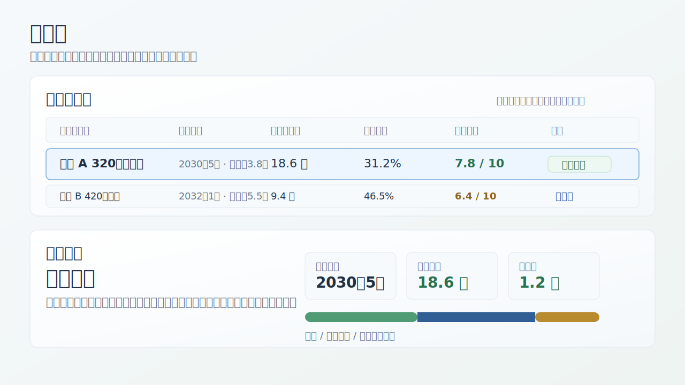
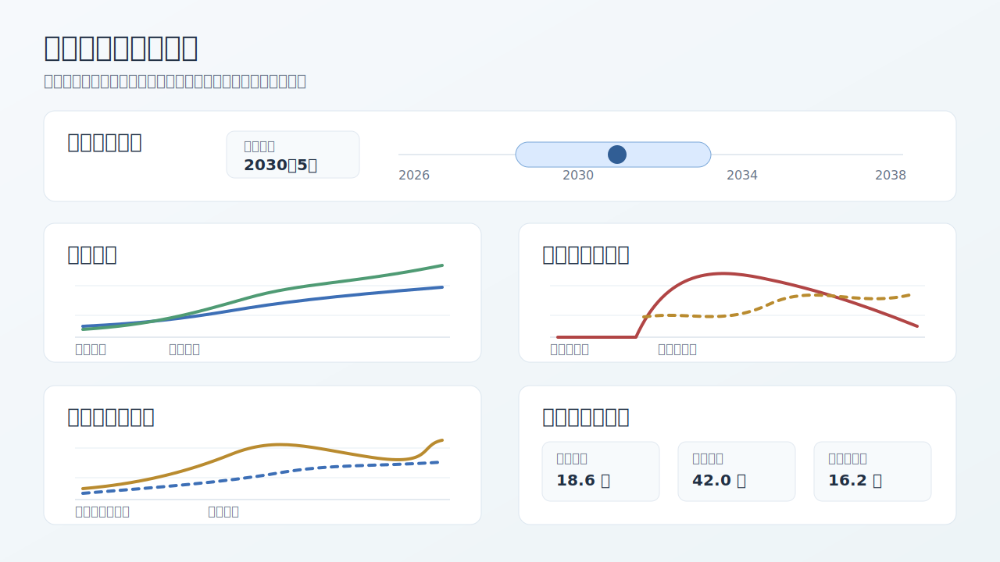
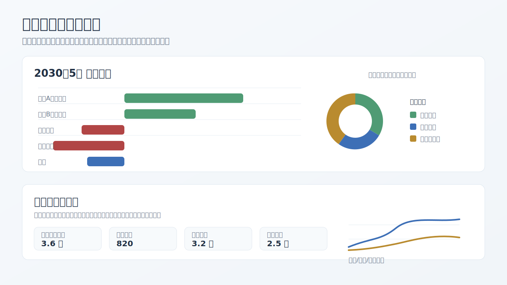

# 北京买房可行性规划计算器

本项目是一个本机使用的北京购房可行性规划工具，包含 React 前端和 FastAPI 后端。家庭财务数据默认保存在本机 SQLite 数据库中，不上传云端。

## 功能

- 家庭财务画像：成员、工资阶段、支出、现金账户、投资账户、公积金账户、目前贷款和购房资格参数。
- 策略生成：围绕目标房源、车辆需求和理财计划自动生成方案，也支持手动调整首付、贷款、购入时间、投资提取等关键参数。
- 后端账户推演：现金余额、投资收益、贷款余额、月供、公积金账户、税费、事件时间线等核心计算以后端结果为准。
- 北京政策规则：规则包管理公积金贷款、首付比例、贷款年限、税费、社保个税资格等参数，便于后续扩展到其他地区政策包。
- 可视化故事线：房源决策表、联动月份查看、流动资产、固定资产、贷款余额、公积金账户、月现金流、税务和幸福指数解释。
- 导出方案：按当前选中的方案导出文字说明和详细表格，包含逐月账户、现金流、贷款和事件变化。

## 界面预览

以下预览图均为假数据示例，只用于展示界面结构和功能关系。

### 房源决策与选中策略

可视化页先给出房源决策表，用统一口径比较可买时间、交易后现金、贷款压力、幸福指数和系统判断。点击某个房源后，选中策略摘要会同步切换。



### 账户曲线与联动月份

联动月份查看会同步驱动流动资产、贷款余额、公积金账户、月现金流和后续解释。时间窗口可以聚焦到较短阶段，也可以拖动查看更长期的账户变化。



### 月现金流与税务解释

月现金流展示真实发生的收入、支出、定投、还款和特殊事件；税务模块放在核心账户和现金流之后，用来解释工资从税前到税后、年终奖和个税扣缴的来源。



## 本地启动

### 后端

```powershell
cd backend
python -m venv .venv
.\.venv\Scripts\python -m pip install -r requirements.txt
.\.venv\Scripts\python -m uvicorn app.main:app --host 127.0.0.1 --port 8000 --reload
```

### 前端

```powershell
cd frontend
npm install
npm run dev -- --host 127.0.0.1
```

打开 Vite 输出的本地地址即可使用。默认前端会请求 `http://127.0.0.1:8000`。

## 首次初始化

首次启动后，系统会创建一个空白家庭，默认不添加购房或买车目标。建议按以下顺序配置：

1. 在“家庭财务”页填写家庭画像、成员名称、工资阶段、基础支出、现金账户、投资账户和公积金账户。
2. 如有需要，继续添加目前贷款、其他定时支出、老人专项扣除、职业冲击和退休养老金假设。
3. 在“购房计划”页按需添加目标房源，并设置目标总价、面积、房屋性质、贷款方式和装修资金模式。
4. 在“理财计划”“买车计划”页按自己的目标生成或手动调整策略。
5. 点击“保存本地”，数据会写入本机 SQLite 数据库。

如果你已经在本机使用过旧版本，原有数据库不会自动清空。需要重新初始化时，请先备份后删除本机数据库文件，或设置新的 `HOUSE_PLANNER_DB` 路径。

## 数据位置

默认 SQLite 数据库位于系统应用数据目录：

- Windows: `%APPDATA%\house-planner\planner.db`
- 其他系统: `~/.house-planner/planner.db`

可以通过 `HOUSE_PLANNER_DB` 环境变量指定数据库路径。

## 开发与发布流程

推荐保持一条清晰的双轨流程：

1. 日常功能开发在 `codex/public-release` 分支进行。
2. 页面运行数据默认保存在本机 SQLite 数据库里，默认位置是 `%APPDATA%\house-planner\planner.db`，不进入 Git。
3. 代码里的默认值、测试样例和 README 使用可复现的示例数据。
4. 推送前运行：

```powershell
.\scripts\push_public.ps1
```

这个脚本会依次执行发布检查、后端测试、前端构建，并把 `codex/public-release` 推送到 GitHub `main`。

如只想快速验证发布检查：

```powershell
python scripts/privacy_scan.py --ref HEAD
python scripts/privacy_scan.py
```

本仓库还提供 `.githooks/pre-push`，用于在推送前拦截以下情况：

- 从非 `codex/public-release` 分支推送到 `main`
- 推送不符合当前发布分支基线的历史
- 待推送内容包含数据库、构建产物、依赖目录或本地配置片段

首次克隆或换机器后，可以启用本仓库的 Git hook：

```powershell
git config core.hooksPath .githooks
```

## 数据文件说明

- 不要把本机 SQLite 数据库、导出方案、截图、`.env`、日志或个人配置文件提交到 Git。
- `.gitignore` 已排除常见数据库、构建产物、虚拟环境和环境变量文件。
- 发布分支应从当前基线继续开发，避免混入旧分支历史。
