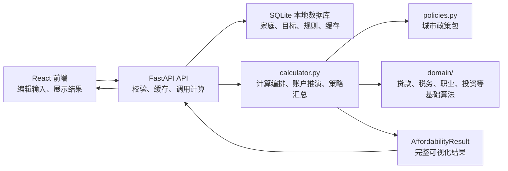
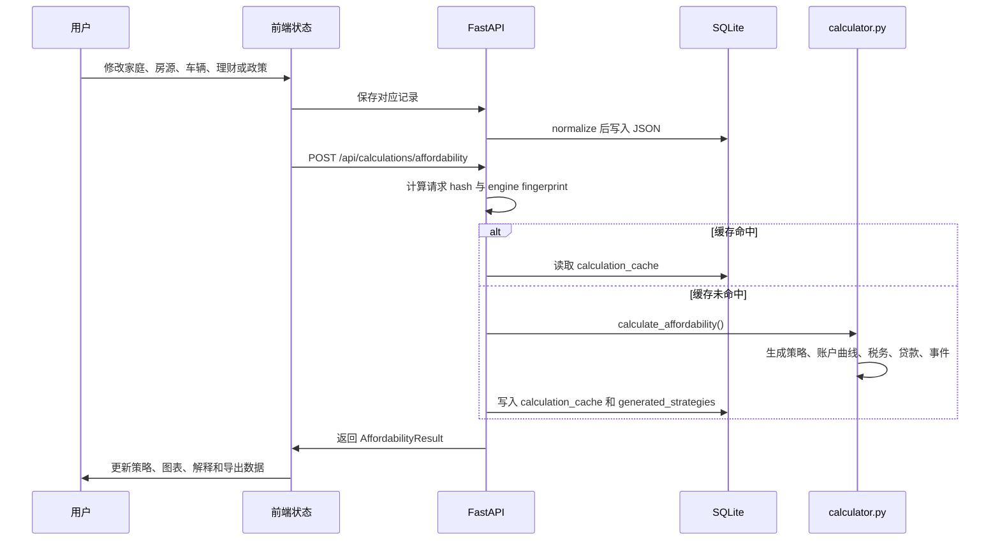

# 开发者架构说明

这份文档面向接手本项目的开发者，目标是解释系统整体关系、核心概念、数据流、计算边界和常见改动路径。项目不是一个简单的前端表单工具，而是一个“后端负责推演、前端负责表达和展示”的本地家庭财务规划系统。

## 一句话架构

本项目由 React 前端、FastAPI 后端和 SQLite 本地数据库组成。用户在前端维护家庭数据、重大消费目标和政策假设；后端根据这些输入生成策略、账户曲线、税务、贷款、事件时间线和可视化数据；前端只展示后端结果，不重新承担核心计算。



## 目录职责

### 后端

- `backend/app/main.py`  
  FastAPI 路由层。负责提供家庭、房源、规划目标、规则包、行情快照、计算结果等 API。这里不写业务计算，只做请求校验、缓存命中、调用计算和返回响应。

- `backend/app/schemas.py`  
  系统的结构化契约中心。Pydantic 模型定义了前后端传输结构、数据库 JSON 结构、计算输入和输出。新增字段时通常必须同步修改这里、前端 `types.ts`、默认值、数据库 normalization 和测试。

- `backend/app/calculator.py`  
  后端计算编排入口。它负责把请求输入、政策包、领域算法和数据库缓存串起来，汇总税务、收入阶段、支出阶段、投资、贷款、购房策略、购车策略、养娃策略、幸福指数、账户曲线、事件时间线和导出所需数据。这个文件不应继续吸收新的纯算法；新增可复用计算时优先下沉到 `domain/` 或专门模块。

- `backend/app/policies.py`  
  政策抽象层。北京政策包应从这里返回公积金贷款、贷款年限、贷款利率、契税、扣除、车相关政策等规则。地区政策、政策上下限、政策口径不应散落在前端或策略生成细节里。

- `backend/app/domain/`  
  基础领域算法。当前包含：
  - `loans.py`：贷款月供、余额、提前还款、车贷贴息等通用算法。
  - `time.py`：年月解析、月份距离、年龄月份等时间工具。
  - `vehicles.py`：车辆购置税、车船税、北京小客车指标、家庭新能源积分、租牌现金情景和养车成本估算。
  - `children.py`：子女计划出生时间推定、阶段性养育支出、养娃策略说明和子女计划幸福指数估算。
  - `expenses.py`：日常支出阶段、租房支出阶段、一次性或年度支出发生月份、租房中介费和服务费估算。
  - `tax.py`：个人所得税基础税率、年终奖发放/归属口径、收入阶段生效判断、北京社保公积金缴费明细等纯税务基础算法。
  - `career.py`：职业冲击、失业金、灵活就业自缴、退休养老金阶段等职业生命周期算法。
  - `investments.py`：理财收益税后口径、投资组合摘要和月度投资账户分配。
  - `scoring.py`：幸福指数、现金安全、贷款压力和策略偏好评分等解释性指标。

- `backend/app/database.py`  
  SQLite 读写层。负责建表、初始化、当前格式 normalization、缓存清理和记录存取。数据库记录主体是 JSON 字段，结构由 `schemas.py` 和 `storage/normalization.py` 控制。

- `backend/app/storage/normalization.py`  
  数据格式归一化入口。负责把旧数据、缺省字段、目标结构转换成当前 schema。后续数据库格式变化时，应把数据一次性转换为最新格式，避免长期保留旧格式兼容逻辑。

- `backend/app/storage/schema_version.py`  
  当前数据库结构版本。schema 或持久化数据结构变化时应升级版本，并通过 normalization 把本地数据转换到最新格式。

- `backend/tests/`  
  后端 API、计算器、政策和编码扫描测试。计算逻辑变更必须优先补测试，尤其是政策数值、现金流、贷款余额、税务和策略生成。

### 前端

- `frontend/src/App.tsx`  
  当前主要页面和交互集中在这里。它负责组织页面、维护表单状态、调用 API、展示图表和策略说明。注意：这里不应该重新推演现金、贷款、税务或账户曲线。

- `frontend/src/types.ts`  
  前端类型契约，应与 `backend/app/schemas.py` 对齐。

- `frontend/src/api.ts`  
  API 调用封装。新增后端路由时优先在这里增加调用函数。

- `frontend/src/styles.css`  
  全局视觉语言、浅色/深色主题、表单、按钮、卡片、图表容器和响应式布局。

前端修改完成后要做真实渲染检查，而不是只看构建是否通过。桌面端至少用常见笔记本宽度检查一轮，移动端至少用窄屏比例检查一轮，重点看导航、目标卡片、表单控件高度、错误提示、图标按钮可访问名称、图表 tooltip 和深色模式对比度。API 或网络异常必须转成中文用户提示，不能让 `Failed to fetch`、后端字段名或英文堆栈直接出现在界面上。

### 脚本和文档

- `scripts/encoding_scan.py`：检查 UTF-8 和中文乱码。
- `scripts/privacy_scan.py`：发布前隐私扫描。
- `scripts/push_public.ps1`：发布检查和推送脚本。
- `docs/images/`：README 使用的假数据预览图。

## 核心原则

### 后端是计算真源

以下内容必须以后端为准：

- 现金账户、投资账户、公积金账户、社保/医保账户和固定资产变化。
- 税前到税后、社保、公积金、专项扣除、年终奖、自由职业收入等税务结果。
- 房贷、车贷、当前贷款的月供、余额、利息、提前还本、冲还贷。
- 买房、买车、理财、养娃等策略生成。
- 事件时间线、账户曲线、月现金流和导出表格。

前端可以做输入校验、布局、中文解释、筛选和图表交互，但不能在后端结果之外“补算一套业务逻辑”。如果发现前端有兜底计算，要优先迁回后端。

### 数据结构是系统骨架

系统的核心输入大致是：

- `HouseholdData`：家庭、成员、收入阶段、支出阶段、账户余额、已有贷款、理财、税务、养娃等。
- `ScenarioData`：单个房源目标的专业参数。
- `CarPlanData` / `VehiclePlanData`：车辆需求、候选车源和金融方案。
- `PlanningGoalData`：重大消费目标的统一抽象。
- `RulePackData`：政策规则包和可调假设。
- `AffordabilityRequest`：一次完整计算请求。

系统的核心输出是 `AffordabilityResult`，里面包括：

- `purchase_plan_analyses`：购房策略候选。
- `car_plan_analyses`：购车策略候选。
- `investment_plan_recommendations`：理财策略候选。
- `child_plan_strategies`：养娃策略。
- `monthly_cashflow_visualization`：月现金流。
- `account_snapshots`：账户快照。
- `loan_visualization`：贷款余额与月供。
- `provident_visualization`：公积金账户。
- `social_security_visualization`：养老、医保等个人账户。
- `tax_monthly_points` / `tax_year_summaries` / `tax_strategy_timeline`：税务月度、年度和长期策略时间线结果。
- `plan_events`：事件时间线。
- `strategy_explanations`：策略解释。

## 重大消费目标模型

买房、买车、未来可能的装修、换车、教育等，都应理解为“重大消费目标”。当前系统已经引入 `planning_goals` 表，用于统一管理目标：

```text
planning_goals
  id
  household_id
  goal_type: home | vehicle | ...
  data:
    name
    enabled
    priority
    timing_mode
    earliest_purchase_delay_months
    planning_window_start_month
    planning_window_end_month
    depends_on_goal_id
    delay_after_dependency_months
    allow_parallel
    target_params
    financing_preferences
    holding_cost_params
    selected_strategy_id
```

买房和买车仍保留各自专业参数：

- 房源需要房屋性质、面积、总价、公积金政策属性、商贷、公积金贷、装修等参数。
- 车辆需要能源类型、北京小客车指标、候选车源、经销商金融方案、保险、保养、实际性能使用期和报废或更新里程等参数。非营运小微型载客汽车通常不是固定年限强制报废；系统默认按 10 年实际使用期估算，可由用户手动调整。

但两者的交互和后端管理应尽量统一：

- 默认没有目标，由用户手动添加。
- 目标可新增、复制、删除、停用。
- 每个目标有优先级、购买时机和是否并行考虑。
- 每个目标都有统一的“计划时间窗口”。买房和买车使用 `planning_window_start_month` / `planning_window_end_month` 表示策略可考虑的起止月份；养娃计划使用出生窗口表达同一概念。后端策略应在窗口内选择具体执行月份，前端不要再为不同页面创造“手动延后”“指定月份”“最早时间”等彼此割裂的语义。
- 每个目标有系统推荐策略和手动策略。
- 删除或停用后应保存完整目标列表，并触发后端重算，不能只在前端临时移除。

## 计算请求生命周期

一次常规计算大致经历以下流程：



`main.py` 里的 `affordability_cache_key()` 会把计算引擎指纹、家庭数据、房源数据和规则包数据组合成缓存 key。只要计算相关代码或输入变化，缓存就应失效。

## 数据库与迁移

默认数据库路径：

- Windows: `%APPDATA%\house-planner\planner.db`
- 可用 `HOUSE_PLANNER_DB` 环境变量覆盖。

数据库主要表：

- `households`：家庭配置。
- `scenarios`：房源配置，兼容现有购房页面。
- `planning_goals`：统一重大消费目标。
- `rule_packs`：政策规则包。
- `market_snapshots`：行情或市场假设。
- `calculation_cache`：计算结果缓存。
- `generated_strategies`：从计算结果拆出的策略实体。
- `schema_migrations`：当前 schema baseline。

数据库结构变化时的推荐流程：

1. 在 `schemas.py` 增加或修改模型字段，设置合理默认值和校验。
2. 在 `frontend/src/types.ts` 同步类型。
3. 在 `storage/normalization.py` 把旧记录一次性转成最新结构。
4. 在 `storage/schema_version.py` 升级版本。
5. 初始化或迁移时清理 `calculation_cache` 和 `generated_strategies`。
6. 补 API 和 calculator 测试。

原则：不要长期叠加旧格式兼容读取逻辑。旧字段应在 normalization 阶段转换为新字段，然后系统内部只使用最新结构。

## 政策包关系

政策包通过 `RulePackData` 存储参数，通过 `policies.py` 提供解释性接口。政策相关逻辑要优先从政策包读取，而不是让 UI 或目标参数充当政策真源。

当前政策包承担的典型职责：

- 北京购房资格和最低首付。
- 公积金贷款额度、缴存年限加成、房屋性质加成。
- 公积金贷款年限，受申请人年龄、房龄、房屋结构等约束。
- 公积金首套/二套利率。
- 契税税率。
- 公积金账户还款策略默认值。
- 税务专项扣除和年终奖政策。
- 新能源车购置税、北京小客车指标、车船税等车辆政策。

如果新增城市政策，优先扩展 `PolicyProvider` 接口和 `BeijingPolicyProvider` 的同类实现，再添加新的 provider。不要把“北京”写死在计算流程里。

## 账户、贷款和现金流关系

系统中“账户”和“贷款”是基础概念，不是图表展示的临时分类。

账户包括：

- 现金账户：可立即支付的现金。推演中不能被解释为可为负，低于 0 应转成现金缺口或不可行信号。
- 投资账户：理财资产。收益复投，买房买车或现金缺口时可按策略卖出。
- 公积金账户：受政策限制的专用账户，不能当自由现金处理。
- 养老、医保等个人账户：按成员分开，和公积金一样具有政策属性。
- 固定资产：房产、车辆等。

贷款包括：

- 商业房贷。
- 公积金贷款。
- 车贷。
- 已有贷款。
- 未来可扩展的装修贷、消费贷等。

月现金流应只展示真实经过现金账户的收入和支出。税前工资、个人社保、公积金、个税等是工资扣缴解释，不应混入“可支配现金流”的支出构成。

## 策略生成关系

策略不是前端按钮状态，而是后端基于输入生成的候选结果。每个策略都应回答：

- 什么时候发生。
- 需要多少交易现金。
- 贷款结构是什么。
- 月供和持有成本如何变化。
- 对现金安全、买房速度、买车体验、投资收益和幸福指数有什么影响。
- 为什么推荐或不推荐。

购房策略要考虑：

- 目标房源属性。
- 最低首付、商贷、公积金贷上限和期限。
- 公积金账户还款方式。
- 装修资金模式。
- 买车、养娃、已有贷款和投资策略对购房现金的影响。

购车策略要考虑：

- 车辆需求和候选车源。
- 经销商金融方案，而不是策略自行发明金融产品。
- 全款、高首付、低首付保现金、延后购车、提前还本等差异。
- 北京指标等待。
- 购置税、车船税、保险、保养、停车、能源成本和报废更新。
- 对购房时间和现金安全的影响。

理财策略要考虑：

- 现金安全垫。
- 动态定投和超额现金再投资。
- 买入卖出手续费。
- 税务口径。投资收益税不是工资薪金个税，也不应在前端临时估算；后端应把有效税率扣减到投资账户收益里，并在 `tax_strategy_timeline` 输出“理财税后口径”节点，说明税后收益如何影响理财策略和买房买车时点。
- 买房买车等大额事件前后的投资提取。

税务策略要考虑：

- 长期时间线，而不是只展示当前月或当前年度。
- 收入阶段切换、年终奖发放、专项附加扣除开始或结束、住房租金与首套房贷利息互斥切换、个人养老金开户和缴费、年度汇算等策略动作。
- 子女教育、婴幼儿照护、赡养老人等扣除由哪个成员申报更划算；未指定时前端应明确提示“待指定申报成员”，指定后由后端重新计算对应成员税负和节税。
- 每个税务动作应说明生效年月、申报成员、扣除或缴费金额、估算节税、与其它策略的冲突和后端采用的理由。

## 前端页面关系

顶部页面应按用户工作流组织：

```text
家庭财务 -> 购车计划 -> 购房计划 -> 理财计划 -> 养娃计划 -> 税务 -> 可视化 -> 记账校准 -> 政策规则 -> 导出方案
```

所有计划型页面都应采用同一骨架：

1. 顶部摘要区：说明本页负责什么、后端如何参与计算、当前关键状态是什么。
2. 目标或方案列表：横向卡片用于选择、比较、启用、删除或采用，不把多个完整表单纵向堆叠。
3. 当前选中项配置：只编辑当前选中目标或策略，字段按真实含义分组。
4. 当前策略说明：用顾问式文字解释为什么这样算、哪些由政策决定、哪些由用户偏好决定。
5. 影响预览：展示现金流、账户、税务、贷款、幸福指数或导出预览等后端结果。

颜色语义应保持稳定：现金和流动资产使用绿色；贷款、压力和支出使用红橙；政策和规则使用蓝色；投资使用紫或青紫；固定资产使用金色；警告使用橙色；成功使用绿色。浅色和深色模式只调整明度和对比度，不改变语义。

页面职责：

- 家庭财务：家庭成员、加入家庭时间、账户初始值、收入阶段、支出阶段、已有贷款、老人等基础输入。
- 购车计划：车辆需求、候选车源、金融方案、购车策略和当前策略说明。
- 购房计划：购房需求、候选房源、贷款偏好、购房策略和当前策略说明。
- 理财计划：投资账户、策略推荐、手动策略、费用和税务口径。
- 养娃计划：子女计划、出生时间范围、养育教育支出、税务联动和幸福指数影响。
- 税务：长期税务策略时间线、专项附加扣除归属、年终奖、个人养老金、自由职业税务、投资税务、年度汇算和成员税负明细。
- 可视化：只展示当前选中策略的完整推演，不做输入配置中心。
- 记账校准：独立管理账户或资产校准，不混入家庭画像、收入阶段或支出阶段。
- 政策规则：城市政策包和市场假设。
- 导出方案：按当前选中方案导出详细说明和逐月数据。

## 常见开发任务

### 新增一个输入字段

1. 改 `backend/app/schemas.py`。
2. 改 `frontend/src/types.ts`。
3. 改前端默认值和表单。
4. 改 `storage/normalization.py`，保证旧记录补默认值。
5. 如果影响计算，改 `calculator.py` 或下沉到领域模块。
6. 补测试。

### 新增一个政策参数

1. 在 `RulePackData.params` 增加默认值。
2. 在 `policies.py` 增加读取接口或 helper。
3. 把计算流程改成调用政策接口。
4. 在政策规则页增加中文解释和必要控件。
5. 补政策测试，最好包含边界值和跨时间段。

### 新增一个可视化曲线

1. 后端先在 `AffordabilityResult` 增加结构化数据。
2. `calculator.py` 生成逐月序列。
3. 前端类型同步。
4. 前端图表只读取后端序列。
5. 导出功能如有需要同步加表格。

### 新增一个目标类型

1. 扩展 `PlanningGoalData.goal_type`。
2. 增加该目标的 `target_params` schema。
3. 增加 normalization 和数据库转换。
4. 增加策略生成函数。
5. 增加可视化事件、现金流和账户影响。
6. 前端按“目标列表 -> 候选项 -> 策略对比 -> 当前策略说明”组织页面。

## 测试与验证

常用命令：

```powershell
$Env:PYTHONPATH = "backend"
$Env:PYTHONIOENCODING = "utf-8"
python -m pytest backend/tests/test_api.py backend/tests/test_calculator.py -q -n auto
```

```powershell
Push-Location frontend
npm run build
Pop-Location
```

```powershell
python scripts/encoding_scan.py
python scripts/privacy_scan.py
```

什么时候至少跑什么：

- 改 `schemas.py`、数据库、API：跑后端测试。
- 改 `calculator.py`、`policies.py`、`domain/`：跑后端测试，必要时补政策或策略测试。
- 改前端类型、页面、图表：跑前端构建。
- 改中文文案或文档：跑编码扫描。
- 准备提交或推送：跑隐私扫描。

## 编码和隐私注意事项

项目包含大量中文文案和政策说明，必须使用 UTF-8。不要把终端里的乱码复制回源码。PowerShell 管道中文脚本容易引入编码问题，复杂中文修改优先用 `apply_patch`。

公开仓库不能包含真实家庭数据。代码、测试、README、文档、截图、提交信息都应使用泛化样例，例如“样例成员A”“示例房源”“示例车辆”。真实配置只应存在本机 SQLite 数据库或本机私有脚本中。

## 当前技术债

以下是后续重构时应优先关注的点：

- `frontend/src/App.tsx` 仍然过大，页面组件、图表组件、表单组件可以继续拆分。
- `backend/app/calculator.py` 仍承担很多职责，应继续把策略生成、账户推演、税务推演、公积金和社保账户推演分模块；车辆政策与持有成本、养娃策略、阶段性支出、已有贷款还款推演、职业冲击、投资税务和幸福指数已经下沉到 `domain/`，后续优先拆购房/购车策略编排、公积金账户和月度 ledger。
- 后端内部命名要优先描述真实资金含义。收入阶段里的 `monthly_extra_cash_expense` 只作为旧数据接收占位，规范化时必须清零，计算和前端都不再使用。现金流偏差应通过独立“记账校准”页按月份校准现金、投资、贷款或资产账户来吸收；家庭日常支出、租房、贷款、税费、社保、公积金、个人养老金、职业冲击等仍应进入对应结构化模块。
- 月度推演应优先使用结构化中间结果，避免同一月份为了总额、饼图和文字说明分别重复计算。家庭支出已引入 `MonthlyHouseholdExpenseBreakdown`，后续账户、税务和贷款推演也应逐步采用类似的结构化快照，而不是在不同函数里反复反推。
- 买房和买车已经引入统一目标思路，但仍存在历史 `ScenarioData` 和 `CarPlanData` 双轨结构，后续可进一步收敛到 `planning_goals` 为主。
- 政策包接口还可以更细，尤其是车辆政策、税务政策和跨时间段政策。
- 前端可视化和导出仍应持续检查：所有数值都应来自后端结构化结果，不应靠前端临时反推。
