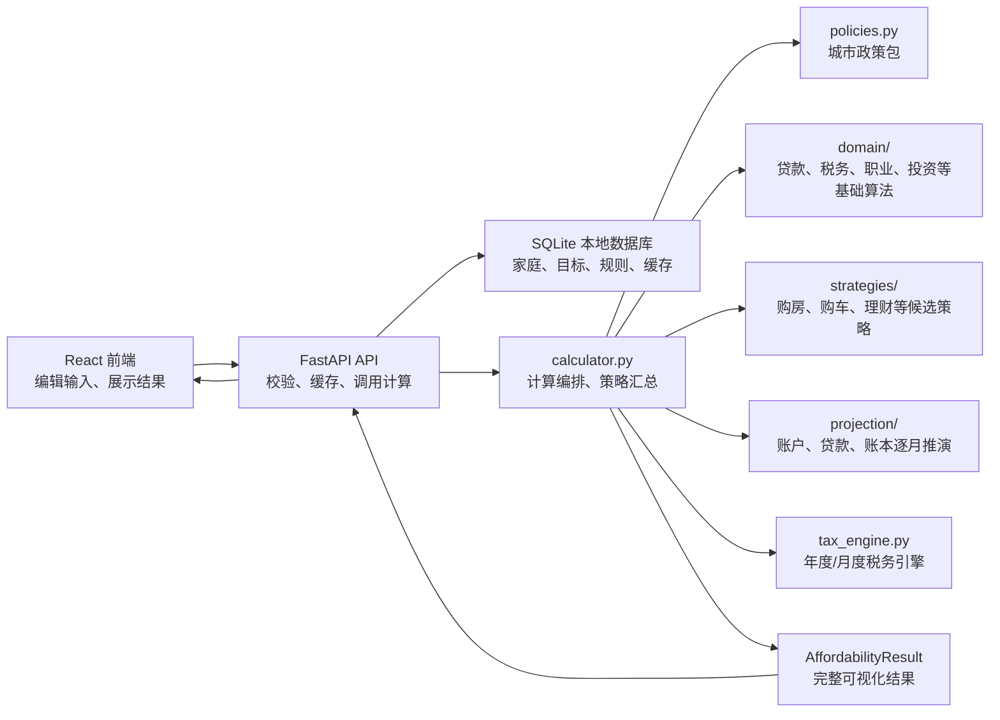
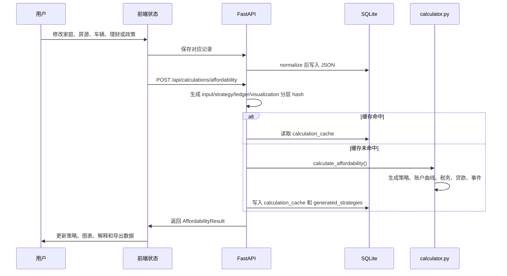

# 开发者架构说明

这份文档面向接手本项目的开发者，目标是解释系统整体关系、核心概念、数据流、计算边界和常见改动路径。项目不是一个简单的前端表单工具，而是一个“后端负责推演、前端负责表达和展示”的本地家庭财务规划系统。

## 一句话架构

本项目由 React 前端、FastAPI 后端和 SQLite 本地数据库组成。用户在前端维护家庭数据、重大消费目标和政策假设；后端根据这些输入生成策略、账户曲线、税务、贷款、事件时间线和可视化数据；前端只展示后端结果，不重新承担核心计算。



## 目录职责

### 后端

- `backend/app/main.py`  
  FastAPI 路由层。负责提供家庭、房源、规划目标、规则包、行情快照、计算结果等 API。这里不写业务计算，只做请求校验、缓存命中、调用计算和返回响应。

- `backend/app/cache.py`  
  计算缓存分层指纹。这里把一次计算拆成 `input`、`strategy`、`ledger`、`visualization` 和 `engine` 五个 hash：输入 hash 来自家庭、房源、规则包和压力测试开关；策略 hash 关注策略生成代码；账本 hash 关注 projection 和账户推演代码；展示 hash 关注 reporting/events/schema；最终 cache key 由这些层组合生成。`AffordabilityResult.cache_layers` 会回传这些 hash，便于判断一次结果命中了哪一版输入、策略、账本和展示逻辑。

- `backend/app/schemas.py`  
  系统的结构化契约中心。Pydantic 模型定义了前后端传输结构、数据库 JSON 结构、计算输入和输出。新增字段时通常必须同步修改这里、前端 `types.ts`、默认值、数据库 normalization 和测试。

- `backend/app/calculator.py`  
  后端计算编排入口。它负责把请求输入、政策包、领域算法、策略推荐、逐月投影模块和数据库缓存串起来，汇总税务、收入阶段、支出阶段、投资、购房策略、购车策略、养娃策略、幸福指数、账户曲线和事件时间线，再交给结果组装层形成 API 响应。这个文件不应继续吸收新的纯算法、候选策略生成、大段逐月账户推演或庞大的响应 DTO 构造；新增可复用计算优先下沉到 `domain/`，新增候选策略和推荐逻辑优先下沉到 `strategies/`，新增账户/贷款/账本时间线优先下沉到 `projection/`。

- `backend/app/calculation_context.py`  
  计算前置上下文层。这里把成员画像派生、阶段性支出生效、职业冲击、税务年度/月度结果、已有贷款汇总、当前现金流家庭、车辆策略上下文、投资建议上下文和购房交易现金成本打包成结构化结果。`calculator.py` 只读取这些上下文继续编排策略、账本和响应，不再在主函数里散落几十个前置局部变量。

- `backend/app/projection_facade.py`  
  投影门面层。这里只把贷款曲线、公积金账户、养老医保账户、月度账本和现金流图表这些已经下沉到 `projection/`、`visualization.py` 的能力重新组合成稳定入口，供 `calculator.py` 和旧测试兼容名调用。这里不应新增业务公式或策略搜索；新的账户、贷款或资产推演应先落到 `projection/` 的具体模块，再由门面暴露薄入口。

- `backend/app/vehicle_facade.py`  
  车辆规划门面层。这里把车贷摘要、车辆贷款状态、车辆现金成本、首付月份、车辆更新月份和购车候选策略组合成稳定入口，供 `calculator.py` 注入到购房策略、投资策略、账本和测试中。具体车辆政策、持有成本和指标计算仍属于 `domain/vehicles.py`；购车候选搜索仍属于 `strategies/vehicle.py`；车辆月度现金流和资产价值仍属于 `projection/vehicles.py`。

- `backend/app/purchase_facade.py`  
  购房策略装配门面层。这里负责把购房候选策略需要的收入画像、家庭支出、租房公积金提取、车辆状态、车辆现金成本、首付月份、亲属首付支持、公积金初始余额和规划窗口延迟等 provider 接好，再调用 `strategies/home.py` 和 `strategies/sensitivity.py`。这里不维护候选策略搜索细节，也不维护贷款或账户推演公式。

- `backend/app/planning_pipeline.py`  
  策略后投影管线。这里接收已经生成的 `PurchasePlanAnalysis` 和车辆状态，按 `Strategy -> Ledger -> Snapshot -> Visualization/Event` 顺序生成贷款曲线、公积金账户、养老医保账户、月度账本、账户快照、月度/年度图表明细、年度摘要、策略解释、事件时间线和养娃策略。它不负责生成候选策略，也不反推展示口径；所有展示数据都从 ledger、snapshot 和专项账户投影派生。

- `backend/app/strategy_pipeline.py`  
  策略运行管线。这里把购房候选策略、收益率敏感性和策略后投影管线串起来，输出 `StrategyPipelineResult`。`calculator.py` 只负责把家庭上下文、车辆上下文和购房现金上下文交给它，不再维护“有购房目标/无购房目标”两套策略与投影变量展开逻辑。

- `backend/app/policies.py`  
  政策抽象层。北京政策包应从这里返回公积金贷款、贷款年限、贷款利率、契税、扣除、车相关政策等规则。地区政策、政策上下限、政策口径不应散落在前端或策略生成细节里。

- `backend/app/tax_engine.py`  
  税务推演引擎。这里承接成员月度收入画像、家庭月度收入汇总、累计预扣预缴、年终奖计税、专项附加扣除、年度税务汇总、月度税务点、个人养老金缴费和节税估算，以及税务策略时间线入口。公积金、养老医保和月度账本投影需要收入画像时应调用这里的公开 provider；`calculator.py` 只导入这些公开函数参与总流程，不再直接维护大段税务内部状态。

- `backend/app/events.py`  
  通用事件派生层。这里承接不属于单一购房/购车/税务策略的事件时间线节点，例如当前账户快照、理财策略启动、账户校准事件、自动收入阶段事件、无车模式事件、公积金退休销户事件、退休后长期观察窗口事件，以及养娃策略转换出的备孕、孕期、出生和教育阶段事件。完整的 `plan_events` 聚合、排序和事件上下文装配也在这里完成；`calculator.py` 只注入初始账户余额、退休观察窗口和“某个购房策略下的车辆状态”等 provider，避免编排入口继续直接拼装大量 `PlanEventPoint`。

- `backend/app/visualization.py`  
  展示转换层。这里把 `projection.ledger` 产出的 `MonthlyProjectionState` 和 `MonthlyLedgerEntry` 转成前端需要的 `MonthlyCashflowPoint`。月现金流图表点应从账本状态和流水派生，不能在 projection 主循环里直接混合展示字段。

- `backend/app/reporting.py`  
  报告和解释派生层。年度财务摘要、账户概念说明和策略解释在这里生成；年度汇总应优先从 `MonthlyLedgerEntry` 和 `AccountSnapshotPoint` 聚合，贷款、公积金、养老医保等专项序列只作为专业账户补充来源，不应再从前端图表点反推年度口径。

- `backend/app/result_assembly.py`  
  API 结果组装层。这里把计算入口已经生成的策略、税务、账本、账户快照、图表明细、事件、年度摘要和导出内容组装成 `AffordabilityResult`，并维护最终响应里的通用 assumptions。这里不重新计算可行性、账户曲线或策略，只做 DTO 打包和导出字段填充，避免 `calculator.py` 继续直接维护庞大的响应构造代码。

- `backend/app/planning_summary.py`  
  规划摘要层。这里根据购房目标和政策包生成最终响应需要的商贷/公积金贷摘要、公积金贷款期限理由，并根据已生成的贷款摘要、车辆现金成本、首付税费、收入支出、DTI 阈值和应急金要求生成 `AffordabilityStatusSummary`：总现金需求、剩余现金、资金缺口、月供、购后现金流、负债收入比、应急月数和可行性状态文案。这里不生成候选策略、不推演账户曲线，只把主流程已有结果压缩成最终响应需要的规划判断。

- `backend/app/domain/`  
  基础领域算法。当前包含：
  - `loans.py`：贷款月供、余额、提前还款、车贷贴息、贷款摘要、商贷还款方式和商贷提前还本模式等通用贷款口径。
  - `time.py`：年月解析、月份距离、年龄月份等时间工具。
  - `vehicles.py`：车辆购置税、车船税、北京小客车指标、家庭新能源积分、租牌现金情景、车辆更新/报废提醒月份、养车成本估算和车贷摘要计算。车贷摘要会调用通用贷款投影，输出首付、贷款本金、贴息、月供、提前还本和车辆政策说明。
  - `housing.py`：住房交易和公积金贷款基础规则，包括最低首付比例、契税、经纪费、卖方税转嫁、房源类型判断、公积金贷款利率、贷款年限、政策加成、还款方式口径和公积金贷款额度上限。购房策略不应直接散落这些政策读取和额度测算。
  - `household.py`：家庭成员派生画像、北京购房资格判断、购房目标顺序和多套房目标对家庭既有住房/既有房贷口径的影响。`calculator.py` 只保留兼容入口，不直接维护这些家庭画像和目标口径。
  - `children.py`：子女计划出生时间推定、阶段性养育支出、养娃策略说明和子女计划幸福指数估算。
  - `expenses.py`：日常支出阶段、租房支出阶段、一次性或年度支出发生月份、租房中介费和服务费估算，以及 `MonthlyHouseholdExpenseBreakdown` 家庭月支出拆解。现金流、医保可支付支出、养娃支出和职业冲击自缴等支出口径应从这里进入月度账本，`calculator.py` 只保留兼容包装。
  - `tax.py`：个人所得税基础税率、年终奖发放/归属口径、收入阶段生效判断、北京社保公积金缴费明细等纯税务基础算法。
  - `career.py`：职业冲击、失业金、灵活就业自缴、退休养老金阶段等职业生命周期算法。
  - `investments.py`：理财收益税后口径、投资组合摘要、月度投资账户分配、现金/投资账户未来值滚动，以及购房交易时投资账户动用/清仓/保留余额的现金结果。
  - `scoring.py`：幸福指数、现金安全、贷款压力和策略偏好评分等解释性指标。

- `backend/app/strategies/`  
  策略推荐层。这里承接“给定家庭、目标、政策和当前压力后，应生成哪些候选方案”的逻辑，避免 `calculator.py` 继续堆积购房、购车、理财、税务、养娃等候选策略细节。当前包含：
  - `investment.py`：理财策略候选推荐，包括现金安全垫、月结余、车辆成本、投资比例和推荐理由。
  - `home.py`：购房候选策略辅助和生成层。这里承接购房策略月度上下文 `PurchasePlanningContext`，包括收入、支出、车辆现金成本、车辆首付、公积金租房提取、现金/投资/公积金准备曲线、首付/商贷/公积金贷组合、交易月资金状态和购后现金压力缓存；同时承接购房候选方案规格、候选月份搜索、微量商贷比例候选、贷款组合购后现金压力筛选、公积金等额本息/等额本金选择结果 `ProvidentRepaymentChoice`、装修资金计划 `RenovationFundingPlan`、公积金还款方式建议、幸福指数分解、交易月资金状态计算，包括现金/投资账户未来值、公积金交易前抵扣、亲属首付支持、投资账户变现、交易后现金和交易后公积金余额。
  - `home_provident_strategy.py`：购房贷后公积金账户策略层。这里统一判断北京市管/国管公积金账户管理中心、政策默认还款方式、按月约定提取、北京半年度冲还贷、两者阶段切换、冲还贷等效月额、策略说明、提取说明和购后现金压力推演；`home.py` 只调用这些结果生成购房候选方案，不再直接维护贷后公积金策略细节。
  - `home_commercial_prepayment.py`：购房商贷提前还本策略层。这里根据商贷利率、投资税后机会成本、购后现金流、现金安全垫和还款方式，自动选择是否提前还商贷、提前还本开始月和每月金额，并生成 `CommercialPrepaymentPlan` 与提前还本贷款投影；候选搜索在 `home.py` 中调用该模块。
  - `home_recommendations.py`：购房候选策略推荐层。这里把已生成的房源策略按可买时间、现金安全、月供压力、债务收入比、幸福指数和用户流动性偏好打分，写入推荐分、推荐理由和系统推荐标记；候选搜索本身仍留在 `home.py`。
  - `home_events.py`：购房策略事件派生层。这里把已经生成的 `PurchasePlanAnalysis` 转成事件时间线节点，包括购房交易、首付与公积金提取、投资账户变现、贷款结构、公积金还贷方式切换、现金缺口和装修资金事件；通用 `events.py` 只聚合这些节点，不再从 `home.py` 直接读取事件函数。
  - `sensitivity.py`：收益率敏感性策略辅助，通过注入购房策略生成器比较不同理财年化下的可买时间和交易后现金。
  - `stress.py`：压力场景策略辅助，生成利率上浮、收入下行和房价上行情景，并通过注入的 affordability 计算器复用主流程评估结果，避免压力测试搜索逻辑回流到 `calculator.py`。
  - `tax.py`：税务策略项、税务事件和策略时间线派生，把住房租金/房贷利息互斥、子女相关扣除、个人养老金扣除、手动专项附加扣除、收入阶段开始/结束、年终奖发放、理财收益税后口径和年度汇算节点组合成前端可展示的长期税务策略时间线。
  - `vehicle.py`：购车候选策略生成、选择和事件派生层。这里负责展开车辆需求、候选车源和经销商金融方案，搜索全款、高首付、低首付、提前还本和延后购车等代表性方案，比较首付比例、购车时间、现金安全、月压力、贴息后车贷成本和提前还本净收益；同时负责把选中车辆计划转换成 `VehicleLoanState`、聚合多车车贷摘要，把用户选中的策略解析回车辆计划，并把购车、贴息期结束、贷款结清、车辆更新/报废提醒转成事件时间线节点。`calculator.py` 只注入家庭支出和车贷计算回调，不直接维护购车策略搜索细节。

- `backend/app/projection/`  
  逐月投影层。这里承接“给定家庭、策略和政策后，某类账户或贷款如何沿时间线变化”的逻辑，避免 `calculator.py` 继续膨胀成单文件账本引擎。当前包含：
  - `planning.py`：投影装配门面。这里负责把家庭、购房/购车策略、政策包和税务收入画像接成贷款曲线、公积金账户曲线、养老医保账户曲线和月度账本；`calculator.py` 保留同名兼容入口，但只委托给这个门面，不再自己拼装投影 provider。
  - `accounts.py`：账户投影入口辅助层。这里负责构造成员收入上下文、公积金初始账户行、家庭公积金初始余额、公积金账户投影和养老医保账户投影所需的 provider；装配入口由 `planning.py` 统一调用。
  - `loans.py`：房贷、车贷、已有贷款余额、月供、提前还本和公积金抵扣后的贷款投影，并负责把选中购房/购车策略上下文转换成每个方案的贷款曲线输入。
  - `horizon.py`：可视化和账本时间跨度计算，包括退休后观察窗口、房贷/公积金贷期限、车贷期限和车辆更新月份。`calculator.py` 可以注入已经生成的车辆状态，但不应重新维护时间跨度公式。
  - `provident.py`：家庭成员公积金账户逐月缴存、利息、租房提取、购房提取、约定提取、冲还贷、退休销户提取，以及策略搜索时使用的公积金账户未来值滚动。
  - `social_security.py`：养老保险个人账户、医保个人账户缴入、退休后计发支出、医保划入和医保支出。
  - `vehicles.py`：车辆月度投影。这里承接车辆现金流、车贷还款、年度保险/保养/车船税、租牌续费、无车通勤成本、车辆服务期内资产估值和第一辆/后续车辆拆分，月度账本只读取这里生成的 `VehicleMonthProjection`。
  - `context.py`：投影上下文缓存层。这里把成员收入画像缓存包装成 `MemberIncomeProjectionContext`，把月度账本所需的收入画像、家庭支出拆解、车辆状态和车辆月度投影等回调包装成 `MonthlyLedgerProjectionContext`，避免装配层反复创建临时闭包，同时保持 projection 不反向依赖计算入口。
  - `accounts_ledger.py`：月度账本里的账户辅助层。这里负责账户校准按月份分组、校准流水标签、外部公积金/养老医保/贷款投影点汇入账本余额、应用账户校准偏移，以及从 `MonthlyProjectionState` 派生 `AccountSnapshotPoint`。主循环只调用这些结构化入口，不再直接维护账户校准细节。
  - `investment_ledger.py`：月度账本里的投资现金状态转移层。这里负责交易月投资账户变现、普通月份收益计提、税费、买入手续费、现金垫不足时的自动卖出补流动性，以及现金垫达标后的追加定投。主循环只消费 `InvestmentCashState`，不直接维护投资账户内部计算。
  - `ledger_cashflows.py`：月度账本里的现金流归集辅助层。这里负责把家庭支出拆解转换成现金支出口径、把车辆月度投影拆成车贷/能源/保险/保养/停车/租牌/首付等账本字段，并按购房、车辆和校准偏移计算固定资产与贷款余额的账本视图。
  - `ledger_models.py`：月度账本结构化中间模型，包括 `MonthlyProjectionState`、`MonthlyLedgerResult`、账户校准偏移、账户余额、投资现金状态、车辆现金拆分和月度流水输入结构。新增账本字段应优先从这里定义，再由主循环填充，避免散落在多个展示函数里。
  - `ledger_entries.py`：把结构化的 `MonthlyLedgerEntryInputs` 转成 `MonthlyLedgerEntry`。这里只描述真实账户流水的中文标签、账户、分类和方向，不做余额推演。
  - `ledger.py`：月度账本主循环和账本上下文入口。它把收入、支出、车辆、贷款、公积金、养老医保、投资、账户校准和幸福指数等结构化结果串成 `MonthlyProjectionState`、`MonthlyLedgerEntry` 和 `AccountSnapshotPoint`，不再直接维护各领域内部细节。`planning.py` 负责把收入曲线、车辆月度投影、投资提现策略和幸福指数等上下文以回调形式注入，避免 `calculator.py` 直接接触账本细节。

当前主流程已经开始显式调用 `build_monthly_ledger(...)`，该入口在 `calculator.py` 中仅做兼容转发，实际由 `projection.planning.build_monthly_ledger_projection(...)` 装配上下文，再由 `projection.ledger.build_projected_monthly_ledger_from_context(...)` 返回 `projection_states`、账户快照和月度流水；随后 `visualization.build_monthly_cashflow_points(...)` 再把状态和流水转换成前端月现金流图表点。旧的 `build_monthly_cashflow_visualization(...)` 暂时作为兼容包装保留，后续应逐步让调用方直接依赖 ledger/snapshot 语义。

- `backend/app/database.py`  
  SQLite 读写层。负责建表、初始化、当前格式 normalization、缓存清理和记录存取。数据库记录主体是 JSON 字段，结构由 `schemas.py` 和 `storage/normalization.py` 控制。

- `backend/app/storage/normalization.py`  
  数据格式归一化入口。负责把旧数据、缺省字段、目标结构转换成当前 schema。后续数据库格式变化时，应把数据一次性转换为最新格式，避免长期保留旧格式兼容逻辑。

- `backend/app/storage/schema_version.py`  
  当前数据库结构版本。schema 或持久化数据结构变化时应升级版本，并通过 normalization 把本地数据转换到最新格式。

- `backend/tests/`  
  后端 API、计算器、政策和编码扫描测试。计算逻辑变更必须优先补测试，尤其是政策数值、现金流、贷款余额、税务和策略生成。

### 前端

- `frontend/src/App.tsx`  
  当前主要页面和交互集中在这里。它负责组织页面、维护表单状态、调用 API、展示图表和策略说明。注意：这里不应该重新推演现金、贷款、税务或账户曲线。

- `frontend/src/types.ts`  
  前端类型契约，应与 `backend/app/schemas.py` 对齐。

- `frontend/src/api.ts`  
  API 调用封装。新增后端路由时优先在这里增加调用函数。

- `frontend/src/styles.css`  
  全局视觉语言、浅色/深色主题、表单、按钮、卡片、图表容器和响应式布局。

前端修改完成后要做真实渲染检查，而不是只看构建是否通过。桌面端至少用常见笔记本宽度检查一轮，移动端至少用窄屏比例检查一轮，重点看导航、目标卡片、表单控件高度、错误提示、图标按钮可访问名称、图表 tooltip 和深色模式对比度。API 或网络异常必须转成中文用户提示，不能让 `Failed to fetch`、后端字段名或英文堆栈直接出现在界面上。

### 脚本和文档

- `scripts/encoding_scan.py`：检查 UTF-8 和中文乱码。
- `scripts/privacy_scan.py`：发布前隐私扫描。
- `scripts/push_public.ps1`：发布检查和推送脚本。
- `docs/images/`：README 使用的假数据预览图。

## 核心原则

### 后端是计算真源

以下内容必须以后端为准：

- 现金账户、投资账户、公积金账户、社保/医保账户和固定资产变化。
- 税前到税后、社保、公积金、专项扣除、年终奖、自由职业收入等税务结果。
- 房贷、车贷、当前贷款的月供、余额、利息、提前还本、冲还贷。
- 买房、买车、理财、养娃等策略生成。
- 事件时间线、账户曲线、月现金流和导出表格。

前端可以做输入校验、布局、中文解释、筛选和图表交互，但不能在后端结果之外“补算一套业务逻辑”。如果发现前端有兜底计算，要优先迁回后端。

### 数据结构是系统骨架

系统的核心输入大致是：

- `HouseholdData`：家庭、成员、收入阶段、支出阶段、账户余额、已有贷款、理财、税务、养娃等。
- `ScenarioData`：单个房源目标的专业参数。
- `CarPlanData` / `VehiclePlanData`：车辆需求、候选车源和金融方案。
- `PlanningGoalData`：重大消费目标的统一抽象。
- `RulePackData`：政策规则包和可调假设。
- `AffordabilityRequest`：一次完整计算请求。

系统的核心输出是 `AffordabilityResult`，里面包括：

- `purchase_plan_analyses`：购房策略候选。
- `car_plan_analyses`：购车策略候选。
- `investment_plan_recommendations`：理财策略候选。
- `child_plan_strategies`：养娃策略。
- `monthly_cashflow_visualization`：月现金流。
- `monthly_visualization_details`：月现金流和账户图表的选中月展示明细，包括收入/支出饼图、贷款扣款结构、公积金账户收入/支出、养老医保账户收入/支出、现金流归因、顾问说明和解释项，由后端 `visualization.py` 从月度账本结果派生。
- `annual_visualization_details`：年度现金流、流动资产、固定资产、贷款、公积金、养老医保账户等年度饼图明细，由后端 `visualization.py` 从年度摘要派生，前端不再自行拼年度图表口径。
- `tax_visualization_details`：税务页面使用的月度个税、月度扣除、年度成员税负和年度税种构成饼图，由后端 `visualization.py` 从税务年度和月度结果派生。
- `account_snapshots`：账户快照。
- `annual_financial_summaries`：年度财务摘要，由月度 ledger、账户快照和专项账户序列聚合。
- `loan_visualization`：贷款余额与月供。
- `provident_visualization`：公积金账户。
- `social_security_visualization`：养老、医保等个人账户。
- `tax_monthly_points` / `tax_year_summaries` / `tax_strategy_timeline`：税务月度、年度和长期策略时间线结果。
- `plan_events`：事件时间线。
- `strategy_explanations`：策略解释。
- `export_sheets`：结构化导出表格，由后端 `reporting.py` 从 ledger/snapshot 和专项账户序列生成，前端只负责序列化为 CSV。
- `export_texts`：结构化文字导出，由后端 `reporting.py` 从策略、事件、账户快照和专项账户序列生成，前端只负责下载文本。

## 重大消费目标模型

买房、买车、未来可能的装修、换车、教育等，都应理解为“重大消费目标”。当前系统已经引入 `planning_goals` 表，用于统一管理目标：

```text
planning_goals
  id
  household_id
  goal_type: home | vehicle | ...
  data:
    name
    enabled
    priority
    timing_mode
    earliest_purchase_delay_months
    planning_window_start_month
    planning_window_end_month
    depends_on_goal_id
    delay_after_dependency_months
    allow_parallel
    target_params
    financing_preferences
    holding_cost_params
    selected_strategy_id
```

买房和买车仍保留各自专业参数：

- 房源需要房屋性质、面积、总价、公积金政策属性、商贷、公积金贷、装修等参数。
- 车辆需要能源类型、北京小客车指标、候选车源、经销商金融方案、保险、保养、实际性能使用期和报废或更新里程等参数。非营运小微型载客汽车通常不是固定年限强制报废；系统默认按 10 年实际使用期估算，可由用户手动调整。

但两者的交互和后端管理应尽量统一：

- 默认没有目标，由用户手动添加。
- 目标可新增、复制、删除、停用。
- 每个目标有优先级、购买时机和是否并行考虑。
- 每个目标都有统一的“计划时间窗口”。买房和买车使用 `planning_window_start_month` / `planning_window_end_month` 表示策略可考虑的起止月份；养娃计划使用出生窗口表达同一概念。后端策略应在窗口内选择具体执行月份，前端不要再为不同页面创造“手动延后”“指定月份”“最早时间”等彼此割裂的语义。
- 每个目标有系统推荐策略和手动策略。
- 删除或停用后应保存完整目标列表，并触发后端重算，不能只在前端临时移除。

## 计算请求生命周期

一次常规计算大致经历以下流程：



`cache.py` 里的 `affordability_cache_key()` 会把输入、策略代码、账本代码和展示代码的分层 hash 组合成最终缓存 key。这样拆分后的 `strategies/`、`projection/`、`visualization.py`、`reporting.py`、`events.py`、`tax_engine.py` 等文件变化都会让相关缓存失效，不会只因为 `calculator.py` 没变而复用旧结果。

## 数据库与迁移

默认数据库路径：

- Windows: `%APPDATA%\house-planner\planner.db`
- 可用 `HOUSE_PLANNER_DB` 环境变量覆盖。

数据库主要表：

- `households`：家庭配置。
- `scenarios`：房源配置，兼容现有购房页面。
- `planning_goals`：统一重大消费目标。
- `rule_packs`：政策规则包。
- `market_snapshots`：行情或市场假设。
- `calculation_cache`：计算结果缓存。
- `generated_strategies`：从计算结果拆出的策略实体。
- `schema_migrations`：当前 schema baseline。

数据库结构变化时的推荐流程：

1. 在 `schemas.py` 增加或修改模型字段，设置合理默认值和校验。
2. 在 `frontend/src/types.ts` 同步类型。
3. 在 `storage/normalization.py` 把旧记录一次性转成最新结构。
4. 在 `storage/schema_version.py` 升级版本。
5. 初始化或迁移时清理 `calculation_cache` 和 `generated_strategies`。
6. 补 API 和 calculator 测试。

原则：不要长期叠加旧格式兼容读取逻辑。旧字段应在 normalization 阶段转换为新字段，然后系统内部只使用最新结构。

## 政策包关系

政策包通过 `RulePackData` 存储参数，通过 `policies.py` 提供解释性接口。政策相关逻辑要优先从政策包读取，而不是让 UI 或目标参数充当政策真源。

当前政策包承担的典型职责：

- 北京购房资格和最低首付。
- 公积金贷款额度、缴存年限加成、房屋性质加成。
- 公积金贷款年限，受申请人年龄、房龄、房屋结构等约束。
- 公积金首套/二套利率。
- 契税税率。
- 公积金账户还款策略默认值。
- 税务专项扣除和年终奖政策。
- 新能源车购置税、北京小客车指标、车船税等车辆政策。

如果新增城市政策，优先扩展 `PolicyProvider` 接口和 `BeijingPolicyProvider` 的同类实现，再添加新的 provider。不要把“北京”写死在计算流程里。

## 账户、贷款和现金流关系

系统中“账户”和“贷款”是基础概念，不是图表展示的临时分类。

账户包括：

- 现金账户：可立即支付的现金。推演中不能被解释为可为负，低于 0 应转成现金缺口或不可行信号。
- 投资账户：理财资产。收益复投，买房买车或现金缺口时可按策略卖出。
- 公积金账户：受政策限制的专用账户，不能当自由现金处理。
- 养老、医保等个人账户：按成员分开，和公积金一样具有政策属性。
- 固定资产：房产、车辆等。

贷款包括：

- 商业房贷。
- 公积金贷款。
- 车贷。
- 已有贷款。
- 未来可扩展的装修贷、消费贷等。

月现金流应只展示真实经过现金账户的收入和支出。税前工资、个人社保、公积金、个税等是工资扣缴解释，不应混入“可支配现金流”的支出构成。

## 策略生成关系

策略不是前端按钮状态，而是后端基于输入生成的候选结果。每个策略都应回答：

- 什么时候发生。
- 需要多少交易现金。
- 贷款结构是什么。
- 月供和持有成本如何变化。
- 对现金安全、买房速度、买车体验、投资收益和幸福指数有什么影响。
- 为什么推荐或不推荐。

购房策略要考虑：

- 目标房源属性。
- 最低首付、商贷、公积金贷上限和期限。
- 公积金账户还款方式。
- 装修资金模式。
- 买车、养娃、已有贷款和投资策略对购房现金的影响。

购车策略要考虑：

- 车辆需求和候选车源。
- 经销商金融方案，而不是策略自行发明金融产品。
- 全款、高首付、低首付保现金、延后购车、提前还本等差异。
- 北京指标等待。
- 购置税、车船税、保险、保养、停车、能源成本和报废更新。
- 对购房时间和现金安全的影响。

理财策略要考虑：

- 现金安全垫。
- 动态定投和超额现金再投资。
- 买入卖出手续费。
- 税务口径。投资收益税不是工资薪金个税，也不应在前端临时估算；后端应把有效税率扣减到投资账户收益里，并在 `tax_strategy_timeline` 输出“理财税后口径”节点，说明税后收益如何影响理财策略和买房买车时点。
- 买房买车等大额事件前后的投资提取。

税务策略要考虑：

- 长期时间线，而不是只展示当前月或当前年度。
- 收入阶段切换、年终奖发放、专项附加扣除开始或结束、住房租金与首套房贷利息互斥切换、个人养老金开户和缴费、年度汇算等策略动作。
- 子女教育、婴幼儿照护、赡养老人等扣除由哪个成员申报更划算；未指定时前端应明确提示“待指定申报成员”，指定后由后端重新计算对应成员税负和节税。
- 每个税务动作应说明生效年月、申报成员、扣除或缴费金额、估算节税、与其它策略的冲突和后端采用的理由。

## 前端页面关系

顶部页面应按用户工作流组织：

```text
家庭财务 -> 购车计划 -> 购房计划 -> 理财计划 -> 养娃计划 -> 税务 -> 可视化 -> 记账校准 -> 政策规则 -> 导出方案
```

所有计划型页面都应采用同一骨架：

1. 顶部摘要区：说明本页负责什么、后端如何参与计算、当前关键状态是什么。
2. 目标或方案列表：横向卡片用于选择、比较、启用、删除或采用，不把多个完整表单纵向堆叠。
3. 当前选中项配置：只编辑当前选中目标或策略，字段按真实含义分组。
4. 当前策略说明：用顾问式文字解释为什么这样算、哪些由政策决定、哪些由用户偏好决定。
5. 影响预览：展示现金流、账户、税务、贷款、幸福指数或导出预览等后端结果。

颜色语义应保持稳定：现金和流动资产使用绿色；贷款、压力和支出使用红橙；政策和规则使用蓝色；投资使用紫或青紫；固定资产使用金色；警告使用橙色；成功使用绿色。浅色和深色模式只调整明度和对比度，不改变语义。

页面职责：

- 家庭财务：家庭成员、加入家庭时间、账户初始值、收入阶段、支出阶段、已有贷款、老人等基础输入。
- 购车计划：车辆需求、候选车源、金融方案、购车策略和当前策略说明。
- 购房计划：购房需求、候选房源、贷款偏好、购房策略和当前策略说明。
- 理财计划：投资账户、策略推荐、手动策略、费用和税务口径。
- 养娃计划：子女计划、出生时间范围、养育教育支出、税务联动和幸福指数影响。
- 税务：长期税务策略时间线、专项附加扣除归属、年终奖、个人养老金、自由职业税务、投资税务、年度汇算和成员税负明细。
- 可视化：只展示当前选中策略的完整推演，不做输入配置中心。
- 记账校准：独立管理账户或资产校准，不混入家庭画像、收入阶段或支出阶段。
- 政策规则：城市政策包和市场假设。
- 导出方案：按当前选中方案导出详细说明和逐月数据；文字说明和详细表格应优先使用后端 `export_texts` / `export_sheets`，不要在前端重新拼接策略、账户、贷款和账本口径。

## 常见开发任务

### 新增一个输入字段

1. 改 `backend/app/schemas.py`。
2. 改 `frontend/src/types.ts`。
3. 改前端默认值和表单。
4. 改 `storage/normalization.py`，保证旧记录补默认值。
5. 如果影响计算，改 `calculator.py` 或下沉到领域模块。
6. 补测试。

### 新增一个政策参数

1. 在 `RulePackData.params` 增加默认值。
2. 在 `policies.py` 增加读取接口或 helper。
3. 把计算流程改成调用政策接口。
4. 在政策规则页增加中文解释和必要控件。
5. 补政策测试，最好包含边界值和跨时间段。

### 新增一个可视化曲线

1. 后端先在 `AffordabilityResult` 增加结构化数据。
2. `calculator.py` 生成逐月序列。
3. 前端类型同步。
4. 前端图表只读取后端序列。
5. 导出功能如有需要同步加表格。

### 新增一个目标类型

1. 扩展 `PlanningGoalData.goal_type`。
2. 增加该目标的 `target_params` schema。
3. 增加 normalization 和数据库转换。
4. 增加策略生成函数。
5. 增加可视化事件、现金流和账户影响。
6. 前端按“目标列表 -> 候选项 -> 策略对比 -> 当前策略说明”组织页面。

## 测试与验证

常用命令：

```powershell
$Env:PYTHONPATH = "backend"
$Env:PYTHONIOENCODING = "utf-8"
python -m pytest backend/tests/test_api.py backend/tests/test_calculator.py -q -n auto
```

```powershell
Push-Location frontend
npm run build
Pop-Location
```

```powershell
python scripts/encoding_scan.py
python scripts/privacy_scan.py
```

什么时候至少跑什么：

- 改 `schemas.py`、数据库、API：跑后端测试。
- 改 `calculator.py`、`policies.py`、`domain/`：跑后端测试，必要时补政策或策略测试。
- 改前端类型、页面、图表：跑前端构建。
- 改中文文案或文档：跑编码扫描。
- 准备提交或推送：跑隐私扫描。

## 编码和隐私注意事项

项目包含大量中文文案和政策说明，必须使用 UTF-8。不要把终端里的乱码复制回源码。PowerShell 管道中文脚本容易引入编码问题，复杂中文修改优先用 `apply_patch`。

公开仓库不能包含真实家庭数据。代码、测试、README、文档、截图、提交信息都应使用泛化样例，例如“样例成员A”“示例房源”“示例车辆”。真实配置只应存在本机 SQLite 数据库或本机私有脚本中。

## 当前技术债

以下是后续重构时应优先关注的点：

- `frontend/src/App.tsx` 仍然过大，页面组件、图表组件、表单组件可以继续拆分。
- `backend/app/calculator.py` 仍承担编排和少量兼容包装职责。购房策略生成入口已经下沉到 `strategies/home.py`，由 `calculator.py` 注入收入、支出、车辆、公积金初始余额等 provider；购车策略搜索已经下沉到 `strategies/vehicle.py`，车辆政策与持有成本、养娃策略、阶段性支出、职业冲击、投资税务和幸福指数已经下沉到 `domain/`，税务年度/月度推演已经下沉到 `tax_engine.py`，贷款、公积金账户、养老医保账户、月度账本主循环和投影装配门面已经下沉到 `projection/`。后续优先继续收敛多目标顺序规划器、缓存分层和 calculator 中的兼容包装。
- 后端内部命名要优先描述真实资金含义。收入阶段里的 `monthly_extra_cash_expense` 只作为旧数据接收占位，规范化时必须清零，计算和前端都不再使用。现金流偏差应通过独立“记账校准”页按月份校准现金、投资、贷款或资产账户来吸收；家庭日常支出、租房、贷款、税费、社保、公积金、个人养老金、职业冲击等仍应进入对应结构化模块。
- 月度推演应优先使用结构化中间结果，避免同一月份为了总额、饼图和文字说明分别重复计算。家庭支出已引入 `MonthlyHouseholdExpenseBreakdown`，月度现金流已开始用 `MonthlyProjectionState` 统一派生 `MonthlyCashflowPoint` 和 `AccountSnapshotPoint`；后续账户、税务和贷款推演也应逐步采用类似的结构化快照，而不是在不同函数里反复反推。
- 买房和买车已经引入统一目标思路，但仍存在历史 `ScenarioData` 和 `CarPlanData` 双轨结构，后续可进一步收敛到 `planning_goals` 为主。
- 政策包接口还可以更细，尤其是车辆政策、税务政策和跨时间段政策。
- 前端可视化和导出仍应持续检查：所有数值都应来自后端结构化结果，不应靠前端临时反推。
