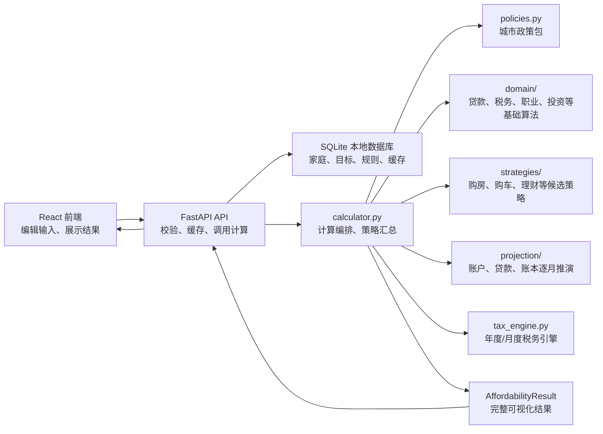
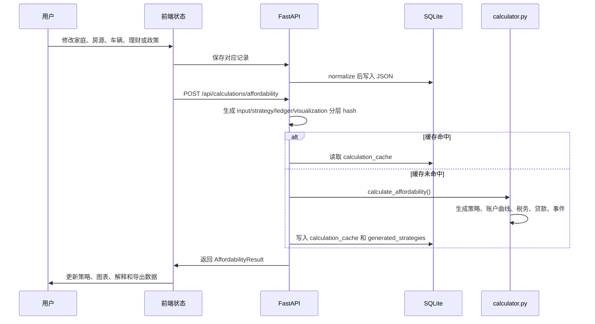

# 开发者架构说明

这份文档面向接手本项目的开发者，目标是解释系统整体关系、核心概念、数据流、计算边界和常见改动路径。项目不是一个简单的前端表单工具，而是一个“后端负责推演、前端负责表达和展示”的本地家庭财务规划系统。


## 一句话架构

本项目由 React 前端、FastAPI 后端和 SQLite 本地数据库组成。用户在前端维护家庭数据、重大消费目标和政策假设；后端根据这些输入生成策略、账户曲线、税务、贷款、事件时间线和可视化数据；前端只展示后端结果，不重新承担核心计


## 目录职责

### 后端

- `backend/app/main.py`  
  FastAPI 路由层。负责提供家庭、房源、规划目标、规则包、行情快照、计算结果等 API。这里不写业务计算，只做请求校验、缓存命中、调用计算和返回响应。

- `backend/app/cache.py`  
  计算缓存分层指纹。这里把一次计算拆成 `input`、`strategy`、`ledger`、`visualization` 和 `engine` 五个 hash：输入 hash 来自家庭、房源、业务规则包、压力测试开关、统一目标/核心对象上下文以及输入上下文代码；策略 hash 关注策略生成代码和运行时策略调度配置；账本 hash 关注 projection、账户推演代码和运行时账本调度配置；展示 hash 关注 reporting/events/schema；最终 cache key 由这些层组合生成。规则包缓存输入只保留会改变计算的 `jurisdiction` 和业务 `params`，规则包名称、状态、来源、备注等展示元数据不会制造新缓存；执行配置也会从业务 input payload 剥离，例如 `backend_parallel_workers` 只影响执行调度。缓存采用内容寻址并保留不同政策参数版本，切回曾计算过的政策时应复用旧结果；相同 planning goal 的重复保存不得清空缓存。前端同时保留有限数量的已完成计算结果，政策切换期间继续展示上一版可视化并在后台刷新，待策略实体和计算结果都准备好后一次性提交界面状态。`AffordabilityResult.cache_layers` 使用显式 `CacheLayerHashes` 模型回传这些 hash，前端规划底座会展示短 hash，便于判断一次结果命中了哪一版输入、策略、账本和展示逻辑；`calculation_cache` 和 `generated_strategies` 会持久化 `engine_fingerprint` 以及 input/strategy/ledger/visualization 四个分层 hash，方便后续按当前 engine 和任一业务层定位缓存失效原因。读取 `generated_strategies` 时默认只返回当前 `engine` 指纹下的策略实体，必要时可显式关闭 current-only 或按某一层 hash 查询历史策略，避免政策、策略或账本代码变化后误用旧策略。

- `backend/app/schemas.py`  
  系统的结构化契约中心。Pydantic 模型定义了前后端传输结构、数据库 JSON 结构、计算输入和输出。新增字段时通常必须同步修改这里、前端 `types.ts`、默认值、数据库 normalization 和测试。

- `backend/app/calculator.py`
  后端计算编排入口。它负责把请求输入、政策包、领域算法、策略推荐、逐月投影模块和数据库缓存串起来，汇总税务、收入阶段、支出阶段、投资、购房策略、购车策略、养娃策略、幸福指数、账户曲线和事件时间线，再交给结果组装层形成 API 响应。这个文件不应继续吸收新的纯算法、候选策略生成、大段逐月账户推演或庞大的响应 DTO 构造；新增可复用计算优先下沉到 `domain/`，新增候选策略和推荐逻辑优先下沉到 `strategies/`，新增账户/贷款/账本时间线优先下沉到 `projection/`。

- `backend/app/calculation_context.py`
  计算前置上下文层。这里把成员画像派生、阶段性支出生效、职业冲击、税务年度/月度结果、已有贷款汇总、当前现金流家庭、车辆策略上下文、投资建议上下文和购房交易现金成本打包成结构化结果。`calculator.py` 只读取这些上下文继续编排策略、账本和响应，不再在主函数里散落几十个前置局部变量。

- `backend/app/engine_config.py`
  后端计算运行时配置层。这里集中读取和校验并行 worker 数量等执行环境参数，供 `calculator.py`、策略管线和账本管线使用。它不属于城市政策包：北京市政策、税费、公积金、社保、车辆指标等业务规则仍在 `policies.py`；线程数、调度上限和类似性能参数不应散落在业务计算里直接读 `RulePackData.params`。

- `backend/app/profiling.py`
  后端性能观测层。默认关闭，不进入 API 响应，也不影响业务缓存；设置 `HOUSE_PLANNER_PROFILE=1` 后，`main.py`、`calculator.py`、`strategy_pipeline.py` 和 `planning_pipeline.py` 会在后端日志中输出计算上下文、缓存、策略生成、账本投影、可视化、响应组装和缓存写入等阶段耗时，供优化时对比冷启动、缓存命中和不同输入规模。

- `backend/app/market_data.py`、`market_calendar.py`、`domain/quant_investment.py`、`domain/quant_backtest.py`、`domain/paper_portfolio.py`、`strategies/quant_investment.py`、`broker_adapters.py`
  量化定投的独立边界。`market_data.py` 只通过本机 `TUSHARE_TOKEN` 拉取日频行情；环境变量优先，未设置时仅读取用户私有的 `%APPDATA%\house-planner\tushare.env`，绝不写入项目、SQLite 家庭数据或前端。行情数据集保存来源接口、抓取时间、交易日历、复权口径、价格日、净值估值日/可得日、完整性、内容哈希和版本，数据库按内容哈希保留不同版本，旧回测引用的快照不会被新数据覆盖。`strategies/quant_investment.py` 用稳定的 `SignalModel → PortfolioConstructor → PreTradeRiskManager → ExecutionPlanner` 编排提案；默认只有月度回撤信号、35/65 权益/防御配置和整手模拟执行，研究优化器默认关闭。防御资产必须由用户手工加入，未配置或受集中度约束的防御额度保留为模拟现金。季度月份仅在权益偏离达到阈值时生成再平衡卖出/买入，模拟现金和可用持仓在成交 API 再校验。`domain/quant_backtest.py` 按实际共同交易日推进，在信号后的下一可交易日成交，并处理防御资产、季度再平衡、停牌、限购、最小交易单位、费率、滑点和净值滞后；除静态 35/65 外还输出现金与 100% 权益基准、24/12 月滚动样本外分段。Recorder 风格运行记录保存策略/标的池/数据版本、参数、成本、区间、指标和警告。模拟订单状态与不可变成交事件在同一 SQLite 事务落库，`PaperPortfolioLedger` 再派生 `MonthlyLedgerEntry → AccountSnapshotPoint → MonthlyVisualizationDetail`，并通过 `AffordabilityResult.paper_portfolio` 进入主计算结果，前端不重算持仓或盈亏。事前风控覆盖现金安全垫、未来 24 个月支出/目标、交易资格、QDII 溢价、集中度和订单限额；事后异常只冻结新增。`BrokerAdapter` 固定提供提交、撤单、订单/持仓/现金查询和对账，`LocalFirstBrokerGateway` 强制本地先落账；`QmtBrokerAdapter` 在券商书面确认和只读对账阶段完成前始终不可执行。行情、标的、政策和新成交会递增 `HouseholdData.quant_investment_data_version` 并进入 affordability input cache 指纹。详细流程与凭据边界见 `docs/investment-quant-plan.md`。

  `market_calendar.py` 独立封装沪深 `trade_cal` 与港股 `hk_tradecal`。接口无权限或不可用时回退到实际价格日期，并把日历来源和警告写入快照；日历开放但缺少价格的日期按停牌处理。跨市场风险篮子必须按共同价格日期对齐，不能按序列长度错位拼接；QDII 净值日龄优先按快照开放交易日计数。模拟账户用资金流中性的单位净值计算当前/历史最大回撤，达到冻结阈值后只暂停新增。最小方差研究策略在每个信号日只使用此前最近 24 个月数据重估权重，再用于下一共同可交易日，测试窗口和未来数据不会进入拟合；该策略默认关闭，也不进入生产提案。

- `scripts/perf_calculation_sample.py`
  固定性能样例脚本。它强制使用临时 SQLite 数据库，默认开启 `HOUSE_PLANNER_PROFILE=1`，通过 FastAPI TestClient 对同一份基准输入连续执行冷启动和缓存命中两次计算，并输出总耗时、cache layer、策略数量和月度账本行数。做计算速度优化前后，应先运行这个脚本保存对比口径，再决定是否需要更完整的业务一致性回归。

- `backend/app/planning_context.py`
  统一规划上下文层。这里负责读取 `planning_goals` 和 `core_objects`，生成 `PlanningFoundationSummary` 和 `CalculationContextSnapshot`，并把统一目标顺序解析结果应用到本次计算用的 `ScenarioData`、`CarPlanData.vehicle_plans` 和 `child_plans`。全局 vehicle/child 目标只在这里投影进本次 `AffordabilityRequest`，让策略和账本能消费同一套目标顺序；它们不会被写回 household JSON，避免跨家庭目标在下一次前端保存时被复制成家庭专属影子目标。上下文里的 planning/core 指纹由规范化内容生成，不读取记录 `updated_at`，让数据库派生索引重建保持缓存稳定。FastAPI 路由只调用这个模块，不直接维护目标顺序、目标指纹、核心对象分组或房/车/养娃约束回写逻辑。

  `planning_goals` 是买房、购车、养娃、装修和其它重大目标的统一主数据。`PlanningGoalData` 外层字段负责名称、启用状态、优先级、规划窗口、依赖关系和选中策略；`target_params` 只保存目标资产或事件本身的业务参数。融资策略必须位于 `financing_preferences`，持有成本必须位于 `holding_cost_params`：例如购房的还款方式、商贷提前还本和投资提取偏好，车辆的金融方案、提前还本与停车/保养/保险等均不得重复写入 `target_params`。旧页面里的 `planning_goal_id`、`purchase_sequence`、`planning_sequence`、`purchase_timing_mode`、`selected_*_variant`、规划窗口字段，以及公积金贷款利率、契税税率这类政策真源字段，也都不应写回 `target_params`。从旧页面投影、直接创建 planning goal、前端保存目标时都必须经过同一套清理规则，避免旧 shadow 对象继续形成第二套真源。

  同一购房顺序下的多个 home goals 是一个逻辑购房需求的候选房源，不是多个连续目标。`domain/planning_goals.py` 必须让它们共享 `planning_group_id`、组名、成员列表、解析顺序和依赖下限；其它目标依赖任一候选房源 ID 时，都规范到该购房需求的代表 ID，并在前端只显示“第一套购房需求（N 个候选房源）”。装修必须是独立 `renovation` planning goal：候选房源不再保存 `renovation_cost` 或 `renovation_funding_mode`，装修目标的预算、资金方式、依赖购房需求和等待时间是唯一真源。计算期可把装修目标临时投影给购房策略兼容字段，但该字段不得通过 API 或数据库持久化；装修支出只在购房后的实际装修事件月份进入账本，不能混入买房交易日现金。

  房产估值监测沿用 home planning goal 的房屋参数，但形成独立、可追溯并进入策略的支线：`Home PlanningGoal / ScenarioData + latest MarketSnapshotData -> domain/property_valuation.py -> 买前价格预测 / property_valuations -> 购房策略、事件时间线和房产监测页`。`MarketSnapshotData.housing_market_evidence` 可以同时保存政府统计、研究机构、专业机构、经纪平台、媒体新闻和其它来源，并记录发布日期、覆盖层级、区/片区或小区名称、覆盖环线、房屋市场、同比/环比、成交单价、样本量和可信度。房源与证据的环线统一为“二环内、二至三环、三至四环、四至五环、五至六环、六环外”；区/片区相同但环线不匹配的样本不得作为地段可比数据。估值模型必须按来源类型、时效、样本量以及区位和环线是否同时命中加权：区级/小区级且环线匹配的成交单价优先参与地段基准，区域周期与全市周期的差异只能形成受限修正；媒体新闻只能低权重影响近端周期，不能直接改变长期锚。房龄、结构、老旧小区改造、土地年限、面积和环线位置继续影响长期保值与流动性折价。购房策略枚举每个候选买入月份时，必须用该月预测价格重新计算税费、首付、商贷、公积金贷和现金压力；短期周期项按 18 个月衰减并逐步回归长期锚，不能把当前同比或环比永久复利。中央预算以目标报价和模型估值中的较高值为起点，低于报价的估值只能作为议价证据，不能静默假定一定能低价成交。预测价格节点以 `property_market` 事件进入时间线，实际买入后的固定资产价值再由账本按持有期假设推演。`total_price` 是目标报价或预算，`valuation_reference_value` 是估值基准，`estimated_market_value` 是模型中位估值，`net_realisable_value` 是扣除出售成本和流动性折价后的决策口径；这些字段不得互相静默覆盖。定期检查只在本地应用运行并打开房产监测页时触发，到期前返回现有记录，不伪装成应用关闭后的后台联网任务。

  个人养老金收益率监测采用同样的本地到期刷新模式：`公开政策/产品登记/指数与机构页面 -> domain/personal_pension_returns.py -> personal_pension_return_snapshots -> RulePack 运行时覆盖 -> domain/personal_pension.py`。政策文件只确认制度和产品边界，不代表保证收益；抓取器只接受带“近一年、年化收益率、业绩比较基准”等收益语义的百分比，并按来源类型、产品类别和样本量加权。自动模式以长期锚为主，市场样本只作有限修正，退休前年化单次最多变化 0.5 个百分点、退休后最多变化 0.3 个百分点；没有可解析样本时沿用上一期，不静默改值。手动模式始终使用成员自行填写的固定假设。快照更新会清理计算和策略缓存，使下一次计算把快照日期和来源数量纳入 input hash；应用关闭时不会宣称仍在后台联网。

- `backend/app/core_objects.py`
  核心对象派生层。这里把家庭 JSON 和 `planning_goals` 转换成统一的 `CoreObjectData`：现金账户、投资账户、成员公积金/养老/医保/个人养老金账户、已有贷款、目标房产、目标车辆、养娃目标、装修/其它规划目标、目标可能形成的规划贷款和账户校准记录。同一购房需求下的多个 home goals 是互斥候选房源，核心对象层只能按购房需求生成一个目标房产和一组规划贷款；候选名称、价格区间和目标 ID 列表写入 metadata，不能把候选价格或贷款相加到“目标/资产”和“贷款”分组。目标派生对象的 `reference_id` 指向具体对象或目标子项，`owner_key` 必须指向对应 `planning_goal_id`；例如目标房产、目标车辆、养娃目标、装修/其它目标、规划商贷、规划公积金贷和规划车贷都应能直接按同一个目标 ID 聚合。核心对象派生记录 ID 必须包含 `household_id + object_type + source + reference_id + category`，不能只靠 reference/category，避免同一个输入引用同时派生账户、资产、贷款或校准记录时互相覆盖。目标贷款对象只用于让统一规划底座、导出和前端解释理解“这个目标可能带来哪类负债”，不代表今天已经发生的贷款现金流；实际贷款余额、月供、提前还本和公积金扣款仍由策略推演和贷款投影逐月生成。规划贷款对象必须写清 `rate_source`：公积金贷款利率属于政策包，核心对象只标记 `policy_pack` 且不从目标参数写入旧利率；商贷利率可作为 `market_quote`，车贷利率可作为 `dealer_financing_option`。`database.py` 只负责把这些派生对象写入 `core_objects` 表，不直接维护对象分类、名称、余额和元数据口径。账户校准记录使用 `object_type = adjustment`、`category = manual_adjustment`，用于解释某个月份后端推演状态被真实账本重置；它必须在 metadata 中保留 `calibration_scope`、`source_id`、`source_category`、`source_title` 和 `reference_name`，让账户概念、重大事件和策略事件校准能从核心对象表追溯来源；它不是账户本体，不作为资产或负债重复并入流动资产、固定资产或贷款分组。
  `timing_mode = not_planned` 或已禁用的目标可以继续出现在目标列表和顺序解析结果里供用户查看，但不能派生目标资产或规划贷款核心对象，避免前端固定资产、贷款和策略实体覆盖率把“暂不纳入规划”的目标当作本次推演对象。
  计算上下文还必须按当前 `scenario_id / planning_goal_id` 收口互斥购房候选：规划底座、账户概念和核心对象分组只保留当前选中房源及其规划贷款，并展示该房源当前采用的策略；其它候选仍保留在购房计划的比较列表中，但不得同时进入目标资产、贷款余额或当前规划底座。

- `backend/app/core_object_concepts.py`
  核心对象概念词典层。这里集中维护后端账户概念定义、核心对象分类到概念的映射、核心对象分组定义和账户校准目标标签。`core_objects.py` 只负责派生具体对象和元数据，`reporting.py` 只负责从快照汇总对象数量、余额和月流量；二者不能各自硬编码 `cash_account`、`fixed_asset_account`、`loan_accounts`、`property_asset`、`manual_adjustment` 等分类/分组口径。该模块同时纳入 input 和 visualization 分层 cache 指纹：对象分类归属变化会让输入上下文失效，概念说明或分组展示变化会让展示层结果失效。

- `backend/app/projection_facade.py`  
  投影门面层。这里只把贷款曲线、公积金账户、养老医保账户、月度账本和现金流图表这些已经下沉到 `projection/`、`visualization.py` 的能力重新组合成稳定入口，供 `calculator.py` 和旧测试兼容名调用。这里不应新增业务公式或策略搜索；新的账户、贷款或资产推演应先落到 `projection/` 的具体模块，再由门面暴露薄入口。

- `backend/app/vehicle_facade.py`  
  车辆规划门面层。这里把车贷摘要、车辆贷款状态、车辆现金成本、首付月份、车辆更新月份和购车候选策略组合成稳定入口，供 `calculator.py` 注入到购房策略、投资策略、账本和测试中。具体车辆政策、持有成本和指标计算仍属于 `domain/vehicles.py`；购车候选搜索仍属于 `strategies/vehicle.py`；车辆月度现金流和资产价值仍属于 `projection/vehicles.py`。

- `backend/app/purchase_facade.py`  
  购房策略装配门面层。这里负责把购房候选策略需要的收入画像、家庭支出、租房公积金提取、车辆状态、车辆现金成本、首付月份、亲属首付支持、公积金初始余额和规划窗口延迟等 provider 接好，再调用 `strategies/home.py` 和 `strategies/sensitivity.py`。这里不维护候选策略搜索细节，也不维护贷款或账户推演公式。

- `backend/app/planning_pipeline.py`  
  策略后投影管线。这里接收已经生成的 `PurchasePlanAnalysis` 和车辆状态，按 `Strategy -> Ledger -> Snapshot -> Visualization/Event` 顺序生成贷款曲线、公积金账户、养老医保账户、月度账本、账户快照、月度/年度图表明细、年度摘要、策略解释、事件时间线和养娃策略。它不负责生成候选策略，也不反推展示口径；所有展示数据都从 ledger、snapshot 和专项账户投影派生。账本在已选购房执行日前 24 个月内自动下调新增风险投资，执行日前 12 个月暂停新增投资，防止推荐与实际账户推演互相矛盾。

- `backend/app/strategy_pipeline.py`  
  策略运行管线。这里把购房候选策略、收益率敏感性和策略后投影管线串起来，输出 `StrategyPipelineResult`。`calculator.py` 只负责把家庭上下文、车辆上下文和购房现金上下文交给它，不再维护“有购房目标/无购房目标”两套策略与投影变量展开逻辑。

- `backend/app/policies.py`  
  政策抽象层。北京政策包应从这里返回公积金贷款额度上限、还款能力月供上限、政策加成、贷款年限、贷款利率、契税、税务基础计算、专项附加扣除、个人养老金税务优惠、车相关政策、职业生命周期、养老金估算、工资社保和公积金扣缴口径等规则。地区政策、政策上下限、政策口径不应散落在前端或策略生成细节里。

- `backend/app/tax_engine.py`  
  税务推演引擎。这里承接成员月度收入画像、家庭月度收入汇总、累计预扣预缴、年终奖计税、专项附加扣除、年度税务汇总、月度税务点、个人养老金缴费和节税估算，以及税务策略时间线入口。公积金、养老医保和月度账本投影需要收入画像时应调用这里的公开 provider；`calculator.py` 只导入这些公开函数参与总流程，不再直接维护大段税务内部状态。

- `backend/app/events.py`  
  通用事件派生层。这里承接不属于单一购房/购车/税务策略的事件时间线节点，例如当前账户快照、理财策略启动、账户校准事件、自动收入阶段事件、无车模式事件、公积金退休销户事件、退休后长期观察窗口事件，以及养娃策略转换出的备孕、孕期、出生和教育阶段事件。`CalculationContextSnapshot.planning_goals` 也会在这里转换成 `source = planning_goals` 的统一规划目标事件，让可视化时间线能直接展示目标顺序、规划窗口和依赖警告。完整的 `plan_events` 聚合、排序和事件上下文装配也在这里完成；`calculator.py` 只注入初始账户余额、退休观察窗口和“某个购房策略下的车辆状态”等 provider，避免编排入口继续直接拼装大量 `PlanEventPoint`。

- `backend/app/visualization.py`  
  展示转换层。这里把 `projection.ledger` 产出的 `MonthlyProjectionState` 和 `MonthlyLedgerEntry` 转成前端需要的 `MonthlyCashflowPoint`。月现金流图表点应从账本状态和流水派生，不能在 projection 主循环里直接混合展示字段。

- `backend/app/reporting.py`  
  报告和解释派生层。年度财务摘要、账户概念说明和策略解释在这里生成；年度汇总应优先从 `MonthlyLedgerEntry` 和 `AccountSnapshotPoint` 聚合，贷款、公积金、养老医保等专项序列只作为专业账户补充来源，不应再从前端图表点反推年度口径。`account_concepts` 会按 `core_object_concepts.py` 的共享概念词典从 `CalculationContextSnapshot.core_objects` 聚合对象数量、当前余额和月流量，让“现金账户、投资账户、公积金、养老医保、固定资产、贷款”等概念说明和核心对象索引保持同源；`core_object_groups` 再按共享分组定义把这些概念归并成流动资产、政策受限账户、固定资产/目标和贷款四类，供前端和导出直接展示。

- `backend/app/result_assembly.py`  
  API 结果组装层。这里把计算入口已经生成的策略、税务、账本、账户快照、图表明细、事件、年度摘要和导出内容组装成 `AffordabilityResult`，并维护最终响应里的通用 assumptions。这里不重新计算可行性、账户曲线或策略，只做 DTO 打包和导出字段填充，避免 `calculator.py` 继续直接维护庞大的响应构造代码。

- `backend/app/planning_summary.py`  
  规划摘要层。这里根据购房目标和政策包生成最终响应需要的商贷/公积金贷摘要、公积金贷款期限理由，并根据已生成的贷款摘要、车辆现金成本、首付税费、收入支出、DTI 阈值和应急金要求生成 `AffordabilityStatusSummary`：总现金需求、剩余现金、资金缺口、月供、购后现金流、负债收入比、应急月数和可行性状态文案。这里不生成候选策略、不推演账户曲线，只把主流程已有结果压缩成最终响应需要的规划判断。

- `backend/app/domain/`  
  基础领域算法。当前包含：
  - `loans.py`：贷款月供、余额、提前还款、车贷贴息、贷款摘要、商贷还款方式和商贷提前还本模式等通用贷款口径。
  - `time.py`：年月解析、月份距离、年龄月份等时间工具。
  - `vehicles.py`：车辆购置税、车船税、北京小客车指标、家庭新能源积分、租牌现金情景、车辆更新/报废提醒月份、养车成本估算和车贷摘要计算的领域入口。新能源识别、车船税、购置税、北京指标资格、家庭新能源积分和预计等待时间等政策公式应调用 `policies.py`，车辆模块只负责把政策结果接入购车策略、现金流和说明文案。车贷摘要会调用通用贷款投影，输出首付、贷款本金、贴息、月供、提前还本和车辆政策说明。
  - `housing.py`：住房交易和公积金贷款基础规则，包括最低首付比例、契税、经纪费、卖方税转嫁、房源类型判断、公积金贷款利率、贷款年限、政策加成、还款方式口径和公积金贷款额度上限。购房策略不应直接散落这些政策读取和额度测算。
  - `household.py`：家庭成员派生画像、北京购房资格判断、购房目标顺序和多套房目标对家庭既有住房/既有房贷口径的影响。`HouseholdData.child_count` 只表示截至当前月份已出生的子女数；未来养娃目标由 `planning_goals` 和投影出的 `child_plans` 表达，不得反写当前家庭资格参数。`calculator.py` 只保留兼容入口，不直接维护这些家庭画像和目标口径。
  - `planning_goals.py`：重大消费目标顺序解析层。这里把 `planning_goals` 表里的买房、买车、装修和其他目标统一解析成 `ResolvedPlanningGoal`：按优先级排序，处理自动顺序、并行考虑、手动年月、依赖某目标之后、延迟月份和规划窗口，并输出可读解释和 warning。后续策略生成应优先消费这个解析结果，而不是在购房、购车、养娃页面各自维护一套顺序语义。
    暂不纳入规划、已禁用或并行考虑的目标不占用 `sequence_index`，也不能作为后续自动顺序目标的默认锚点；如果目标显式依赖暂不纳入规划或已禁用的目标，解析层会给出 warning，并降级为自动顺序，继续跟随前一个有效顺序目标。并行目标可以进入列表和可视化，用户显式选择“跟随该并行目标”时仍可作为依赖目标，但不会把其它自动顺序目标往后挤。
  - `children.py`：子女计划出生时间推定、阶段性养育支出、养娃策略说明和子女计划幸福指数估算；出生延迟、年龄阈值等政策口径必须显式传入 `RulePackData`。
  - `goal_tradeoffs.py`：购房、购车和养娃共享的“提前实现目标—保留财富终值”偏好解析层。自动模式综合目标紧迫度、优先级、生活效用、理财预期收益和现金安全垫缺口生成时间/财富权重；手动模式读取家庭统一倾向。该权重只参与可行候选之间的排序，不能覆盖现金缺口、破产月份或流动资产耗尽等硬门槛。
  - `expenses.py`：日常支出阶段、租房支出阶段、一次性或年度支出发生月份、租房中介费和服务费估算，以及 `MonthlyHouseholdExpenseBreakdown` 家庭月支出拆解。现金流、医保可支付支出、养娃支出和职业冲击自缴等支出口径应从这里进入月度账本；`medical_account_payable` 只对 `expense_category = medical` 的计划支出生效，普通阶段性/年度/一次性支出永远按家庭现金支出处理，前端也不能把医保支付开关显示成通用“现金账户支付”选项；领域层必须显式接收 `RulePackData`，不能在缺少规则时默默按 0 处理政策相关支出，`calculator.py` 只保留兼容包装。
  - `tax.py`：个人所得税基础税率、年终奖发放/归属口径、收入阶段生效判断、社保公积金缴费明细等纯税务基础算法；社保基数、公积金上下限、缴费比例等政策口径必须通过 `policies.py` 注入。年终奖使用 `annual_bonus_months` 表达当前阶段月工资的倍数，支持一位小数；标准奖金金额为“月工资 × 奖金月数”，实际发放额再按奖金归属周期内的在职月数折算。奖金归属区间只保存 1—12 的月份值，不绑定某个自然年份，起始月按该月 1 日开始、截止月按该月最后一日结束；例如 `2 / 1` 且次年 3 月发放，表示上一年 2 月 1 日至当年 1 月 31 日。后端必须先把归属周期定位到发放日前最近一个已结束周期，再与收入阶段实际在职月份求交集，不能只按发放年份的自然月判断。完整年月只用于奖金实际发放事件或收入阶段起止日期。
  - `career.py`：职业冲击、失业金、灵活就业自缴、退休养老金阶段等职业生命周期算法；失业金档位、灵活就业自缴、退休年龄和养老金估算口径必须通过 `policies.py` 注入。
  - `investments.py`：理财收益税后口径、投资组合摘要、月度投资账户分配、现金/投资账户未来值滚动，以及购房交易时投资账户动用/清仓/保留余额的现金结果。
  - `scoring.py`：幸福指数、现金安全、贷款压力和策略偏好评分等解释性指标。

- `backend/app/strategies/`  
  策略推荐层。这里承接“给定家庭、目标、政策和当前压力后，应生成哪些候选方案”的逻辑，避免 `calculator.py` 继续堆积购房、购车、理财、税务、养娃等候选策略细节。当前包含：
  - `investment.py`：理财策略候选推荐，包括现金安全垫、月结余、车辆成本、投资比例和推荐理由。推荐必须使用税后收益和风险调整收益；多个重大目标的资金需求必须分别按各自截止月份累计，不能把远期购房资金错误压缩到近期购车期限。明确采用自动理财策略时，当前推荐参数会进入有效家庭模型和完整账本；若完整推荐额导致现金穿底，计算器会搜索通过现金缺口、破产月份、流动资产耗尽和安全垫约束的最大安全月定投额。若已选目标在二十四个月内执行，还必须计算目标资金、安全垫与变现费用后的缺口，优先生成“重大目标资金优先”方案，不能为了名义收益继续把即将使用的资金投入波动资产。
  - `portfolio.py`：家庭组合策略层。它把购房完整账本风险、购车长期现金压力、理财候选、养娃预算和个人养老金策略放到同一个自由现金约束下；如果当前组合穿底，会返回所需月度改善和按可调整性排序的联动动作。该结果是下一轮主动调整搜索的入口，不能在缺口尚未消失时标成可执行方案。
  - `home.py`：购房候选策略辅助和生成层。这里承接购房策略月度上下文 `PurchasePlanningContext`，包括收入、支出、车辆现金成本、车辆首付、公积金租房提取、现金/投资/公积金准备曲线、首付/商贷/公积金贷组合、交易月资金状态和购后现金压力缓存；同时承接购房候选方案规格、候选月份搜索、微量商贷比例候选、贷款组合购后现金压力筛选、商贷与公积金贷还款方式联合选择、装修资金计划 `RenovationFundingPlan`、两类住房贷款的还款方式建议、幸福指数分解、交易月资金状态计算，包括现金/投资账户未来值、公积金交易前抵扣、亲属首付支持、投资账户变现、交易后现金和交易后公积金余额。自动还款方式会联合枚举商贷和公积金贷的等额本息/等额本金四种组合，先用首月自由现金缓冲做硬筛选，再在可行组合中比较总利息；手动模式才读取房源上的两类贷款还款方式覆盖值。自动投资提取还会枚举少量投资保留额；只有税后、扣风险缓冲后的投资收益超过确定的商贷成本时才进入候选，且保留额必须由后续账本重新验证，不能把风险资产误当成现金安全垫。候选生成阶段的现金压力窗口必须至少覆盖房贷期限和长期退休风险，不能只检查买后两年再等完整账本否决；用户未设置需求时间窗口时，自动搜索默认只在十年决策边界内进行，不能用三十年后买入绕过当前目标不可行。
- `home_provident_strategy.py`：购房贷后公积金账户策略层。这里统一判断北京市管/国管公积金账户管理中心、政策默认还款方式、按月约定提取、北京半年度冲还贷、两者互斥的自动/手动阶段切换、冲还贷等效月额、策略说明、提取说明和购后现金压力推演；`home.py` 只调用这些结果生成购房候选方案，不再直接维护贷后公积金策略细节。
  - `home_commercial_prepayment.py`：购房商贷提前还本策略层。这里根据商贷利率、投资税后机会成本、购后现金流、现金安全垫和还款方式，自动选择是否提前还商贷、提前还本开始月和每月金额，并生成 `CommercialPrepaymentPlan` 与提前还本贷款投影；候选搜索在 `home.py` 中调用该模块。
  - `home_recommendations.py`：购房候选策略推荐层。这里先以现金安全、无现金缺口、无破产月、流动资产未耗尽作为硬门槛，再对长期净资产、最差现金、应急金覆盖、居住效用和买入时间构成的 Pareto 前沿打分；长期净资产中的房产按政策包给出的价格变化、出售成本和流动性折价计算净可变现值，不能把买入总价直接当作现金等价物。压力测试有任一强制场景无可行方案时，名义情景也不得标记为推荐。候选搜索本身仍留在 `home.py`。
  - `home_events.py`：购房策略事件派生层。这里把已经生成的 `PurchasePlanAnalysis` 转成事件时间线节点，包括购房交易、首付与公积金提取、投资账户变现、贷款结构、公积金还贷方式切换、现金缺口和装修资金事件；通用 `events.py` 只聚合这些节点，不再从 `home.py` 直接读取事件函数。
  - `sensitivity.py`：收益率敏感性策略辅助，通过注入购房策略生成器比较不同理财年化下的可买时间和交易后现金。它复用主计算中最快可行的代表性融资结构，只重算收益率变化带来的时点和现金差异；完整融资组合仍只由主购房策略生成，避免敏感性图把同一套候选搜索重复三遍。
  - `stress.py`：压力场景策略辅助，生成利率上浮、收入下行、房价上行以及“收入、利率、房价、理财”联合压力情景，并通过注入的 affordability 计算器复用主流程评估结果，避免压力测试搜索逻辑回流到 `calculator.py`。联合情景会同时压低收入与理财回报、抬高融资和交易价格，并采用更保守的房产终值假设。每项压力结果显式回传 `feasible`、原因、现金缺口、最差现金、破产月和流动资产耗尽月；没有压力可行方案时不得把风险字段伪装成 0。
- `tax.py`：税务策略项、税务事件和策略时间线派生，把住房租金/房贷利息互斥、子女相关扣除、个人养老金扣除、手动专项附加扣除、收入阶段开始/结束、年终奖发放、理财收益税后口径和年度汇算节点组合成前端可展示的长期税务策略时间线。
- `domain/personal_pension.py`：个人养老金生命周期真源。参加资格必须同时满足用户已启用账户、确认参加基本养老保险并具备个人养老金资格；新成员默认不开户、不缴费。全年实际缴费与税前扣除均受政策包年度上限约束，固定月缴和集中缴费都不能把超额资金写入账户。税前扣除按实际缴费月份进入预扣预缴，或按用户选择进入年度汇算，不能在集中缴费前平均提前享受。领取默认不得早于基本养老金领取年龄；只有完全丧失劳动能力、出国（境）定居、符合标准的重大医疗支出、两年内领取失业保险金累计满十二个月、正在领取低保等法定事由配置后，才能按相应月份提前领取。普通现金不足只能暂停缴费，不能触发提前支取。领取到账还必须经过产品赎回延迟、每月可变现比例和赎回/退保费用约束，再计算领取税和现金净到账。收益率是市场假设，不是政策保证收益。自动税优策略在进入主策略管线前，按成员和纳税年度枚举 0 至政策上限之间的代表性缴费额；比较口径是“个人养老金税费后领取终值 + 当年节税再投资终值”与“同额资金继续普通理财的税后、扣买卖费终值”，只有边际净增益为正才生成开户月份和年度缴费表。账本直接消费该年度表，不再把自动模式等同于每年缴满上限。主计算若仍发现自动缴费方案在首次可领取前现金穿底，会对自动缴费成员执行“停止新增缴费”反事实；只有反事实消除穿底，或同时推迟穿底并降低缺口，才采用停缴后的全量策略与账本。已有账户及余额继续计息和领取，开户与缴费不再混为同一动作；手动缴费配置不会被该自动门槛静默覆盖。
  - `vehicle.py`：购车候选策略生成、选择和事件派生层。这里负责展开车辆需求、候选车源和经销商金融方案，搜索全款、高首付、低首付、提前还本和延后购车等代表性方案，比较首付比例、购车时间、现金安全、月压力、贴息后车贷成本和提前还本净收益；候选至少要在购后保留家庭现金安全垫，车贷提前还本以税后、扣费用的投资机会成本比较，而不是税前年化。它同时负责把选中车辆计划转换成 `VehicleLoanState`、聚合多车车贷摘要，把用户选中的策略解析回车辆计划，并把购车、贴息期结束、贷款结清、车辆更新/报废提醒转成事件时间线节点。`calculator.py` 只注入家庭支出和车贷计算回调，不直接维护购车策略搜索细节。

- `backend/app/projection/`  
  逐月投影层。这里承接“给定家庭、策略和政策后，某类账户或贷款如何沿时间线变化”的逻辑，避免 `calculator.py` 继续膨胀成单文件账本引擎。当前包含：
  - `planning.py`：投影装配门面。这里负责把家庭、购房/购车策略、政策包和税务收入画像接成贷款曲线、公积金账户曲线、养老医保账户曲线和月度账本；`calculator.py` 保留同名兼容入口，但只委托给这个门面，不再自己拼装投影 provider。
  - `accounts.py`：账户投影入口辅助层。这里负责构造成员收入上下文、公积金初始账户行、家庭公积金初始余额、公积金账户投影和养老医保账户投影所需的 provider；装配入口由 `planning.py` 统一调用。
  - `loans.py`：房贷、车贷、已有贷款余额、月供、提前还本和公积金抵扣后的贷款投影，并负责把选中购房/购车策略上下文转换成每个方案的贷款曲线输入。
  - `horizon.py`：可视化和账本时间跨度计算，包括退休后观察窗口、房贷/公积金贷期限、车贷期限和车辆更新月份。`calculator.py` 可以注入已经生成的车辆状态，但不应重新维护时间跨度公式。
  - `provident.py`：家庭成员公积金账户逐月缴存、利息、租房提取、购房提取、约定提取、冲还贷、退休销户提取，以及策略搜索时使用的公积金账户未来值滚动。
  - `social_security.py`：养老保险个人账户、医保个人账户缴入、退休后计发支出、医保划入和医保支出。
  - `vehicles.py`：车辆月度投影。这里承接车辆现金流、车贷还款、年度保险/保养/车船税、租牌续费、无车通勤成本、车辆服务期内资产估值和第一辆/后续车辆拆分，月度账本只读取这里生成的 `VehicleMonthProjection`。
  - `context.py`：投影上下文缓存层。这里把成员收入画像缓存包装成 `MemberIncomeProjectionContext`，把月度账本所需的收入画像、家庭支出拆解、车辆状态和车辆月度投影等回调包装成 `MonthlyLedgerProjectionContext`，避免装配层反复创建临时闭包，同时保持 projection 不反向依赖计算入口。
- `accounts_ledger.py`：月度账本里的账户辅助层。这里负责账户校准按月份分组、校准流水标签、外部公积金/养老医保/贷款投影点汇入账本余额、应用账户校准偏移，以及从 `MonthlyProjectionState` 派生 `AccountSnapshotPoint`。校准记录可以来自账户余额、账户概念、重大事件或策略事件，但只有落到明确账户/资产/贷款校准目标后才改变账本基准；事件来源信息用于解释和追溯，不能绕过账本偏移规则直接改展示结果。主循环只调用这些结构化入口，不再直接维护账户校准细节。
  - `investment_ledger.py`：月度账本里的投资现金状态转移层。这里负责交易月投资账户变现、普通月份收益计提、税费、买入手续费、现金垫不足时的自动卖出补流动性，以及现金垫达标后的追加定投。主循环只消费 `InvestmentCashState`，不直接维护投资账户内部计算。
  - `ledger_cashflows.py`：月度账本里的现金流归集辅助层。这里负责把家庭支出拆解转换成现金支出口径、把车辆月度投影拆成车贷/能源/保险/保养/停车/租牌/首付等账本字段，并按购房、车辆和校准偏移计算固定资产与贷款余额的账本视图。
  - `ledger_models.py`：月度账本结构化中间模型，包括 `MonthlyProjectionState`、`MonthlyLedgerResult`、账户校准偏移、账户余额、投资现金状态、车辆现金拆分和月度流水输入结构。新增账本字段应优先从这里定义，再由主循环填充，避免散落在多个展示函数里。
  - `ledger_entries.py`：把结构化的 `MonthlyLedgerEntryInputs` 转成 `MonthlyLedgerEntry`。这里只描述真实账户流水的中文标签、账户、分类和方向，不做余额推演。
  - `ledger.py`：月度账本主循环和账本上下文入口。它把收入、支出、车辆、贷款、公积金、养老医保、投资、账户校准和幸福指数等结构化结果串成 `MonthlyProjectionState`、`MonthlyLedgerEntry` 和 `AccountSnapshotPoint`，不再直接维护各领域内部细节。`planning.py` 负责把收入曲线、车辆月度投影、投资提现策略和幸福指数等上下文以回调形式注入，避免 `calculator.py` 直接接触账本细节。

当前主流程已经开始显式调用 `build_monthly_ledger(...)`，该入口在 `calculator.py` 中仅做兼容转发，实际由 `projection.planning.build_monthly_ledger_projection(...)` 装配上下文，再由 `projection.ledger.build_projected_monthly_ledger_from_context(...)` 返回 `projection_states`、账户快照和月度流水；随后 `visualization.build_monthly_cashflow_points(...)` 再把状态和流水转换成前端月现金流图表点。旧的 `build_monthly_cashflow_visualization(...)` 暂时作为兼容包装保留，后续应逐步让调用方直接依赖 ledger/snapshot 语义。

- `backend/app/database.py`  
  SQLite 读写层。负责建表、初始化、当前格式 normalization、缓存清理和记录存取。数据库记录主体是 JSON 字段，结构由 `schemas.py` 和 `storage/normalization.py` 控制。当前已开始引入核心对象表 `core_objects`，具体对象口径由 `core_objects.py` 派生，数据库层只负责按家庭或目标变化重建索引记录；现阶段它是派生索引层，不替代家庭 JSON 和目标 JSON 的输入源。`property_valuations` 单独保存房产估值历史，按家庭、购房目标和估值日索引，不覆盖购房目标中的报价或预算。`personal_pension_return_snapshots` 保存自动收益假设历史、来源解析状态、稳健区间和下次到期日，不覆盖成员手动收益率字段。`core_objects` 读取应支持 `household_id`、`object_type`、`category` 和 `owner_key` 组合过滤，且多个过滤条件必须按交集语义在数据库层生效，让规划底座或目标级刷新可以直接按目标 ID 取回目标资产、规划贷款和账户调整对象，而不是拉取全量后在前端临时筛。

- `backend/app/domain/property_valuation.py`
  房产价值监测模型。新房和二手房分别读取对应北京市场信号；同比是主要周期依据，环比只以低权重、限幅后的年化值进入近端判断。房龄、结构、老旧小区改造、剩余土地年限、绿色建筑和面积区间调整长期保值与流动性。未来五年路径采用长期锚加 18 个月指数衰减的周期项，禁止把单月涨跌幅永久外推。

- `backend/app/storage/normalization.py`  
  数据格式归一化入口。负责把旧数据、缺省字段、目标结构转换成当前 schema。后续数据库格式变化时，应把数据一次性转换为最新格式，避免长期保留旧格式兼容逻辑。

- `backend/app/storage/schema_version.py`  
  当前数据库结构版本。schema 或持久化数据结构变化时应升级版本，并通过 normalization 把本地数据转换到最新格式。

- `backend/tests/`  
  后端 API、计算器、政策和编码扫描测试。计算逻辑变更必须优先补测试，尤其是政策数值、现金流、贷款余额、税务和策略生成。

### 前端

- `frontend/src/App.tsx`  
  当前主要页面和交互集中在这里。它负责组织页面、维护表单状态、调用 API、展示图表和策略说明。房产监测页已经独立为 `PropertyMonitorPage.tsx`，并在用户进入“房产监测”时按需加载，避免主规划工作流首次加载独立监测页和其图表依赖；后续拆分页面时应继续沿用“独立页面模块 + 按需加载 + 明确加载态”的边界，而不是把页面逻辑重新并回入口。注意：这里不应该重新推演现金、贷款、税务或账户曲线。

- `frontend/src/types.ts`  
  前端类型契约，应与 `backend/app/schemas.py` 对齐。

- `frontend/src/api.ts`
  API 调用封装。新增后端路由时优先在这里增加调用函数。前端业务主流程读取后端策略实体时只封装 `POST /api/generated-strategies/by-cache-layers`，提交完整 `CacheLayerHashes` 批量查询；旧的 `GET /api/generated-strategies` 保留给后端调试和手工检索，不应作为前端页面的普通数据入口，避免绕过 `engine + input + strategy + ledger + visualization` 五层 hash。

- `frontend/src/coreObjects.ts`
  前端核心对象展示辅助层。这里集中维护后端 `account_concepts` 和 `core_object_groups` 的 code 常量、Map 构造、余额/对象数格式化、账户概念展示顺序、记账校准目标选项、记账校准对象到后端账户/分组概念的默认金额映射，以及按 `owner_key` 聚合目标资产、规划贷款和校准对象的结构化摘要。规划底座、家庭财务、记账校准、导出预览等页面需要展示账户、资产、贷款摘要或为校准记录预填后端余额时，应优先复用这里的 helper，避免每个页面自己写一套 `cash_account`、`loan_accounts` 字符串、校准目标标签、核心对象 owner 聚合和格式化口径。后端测试会检查 `backend/app/core_object_concepts.py` 中的概念 code、分组 code 和校准目标都出现在这个 helper 中，防止前后端概念漂移。前端展示目标归属对象时必须优先按 `object_type` 区分 `asset`、`loan` 和 `adjustment`；账户校准这类 `adjustment` 只能作为校准对象计数展示，不能被归入目标资产或贷款摘要。

- `frontend/src/planningGoals.ts`
  前端统一目标辅助层。这里负责把旧页面模型中的购房 `ScenarioData`、购车 `VehiclePlanData` 和养娃 `ChildPlanData` 投影成 `PlanningGoalData`，并集中维护目标类型、顺序标签、timing mode 标签、购房/购车/养娃时间规则 select 选项、依赖目标下拉选项、旧页面目标时间摘要、购房/车辆/养娃目标是否真正纳入当前规划的判断、目标卡片“纳入规划/暂不纳入/已停用”状态文案、购房默认顺序到时间规则的映射、`not_planned` 与 `enabled` 的联动 patch 和规划底座用的目标时间摘要。页面可以继续编辑各目标的专业参数，但不应在 `App.tsx` 里重复写 `not_planned`、`parallel`、`manual_month`、`after_goal` 等展示文案、依赖目标标签、时间规则选项、纳入规划判断、目标状态文案、启停联动、购房默认顺序规则或顺序标签，避免多目标顺序迁移后不同页面对“暂不纳入规划”“并行”“跟随目标”和“自动顺序”的含义不一致。

- `frontend/src/generatedStrategies.ts`
  前端策略实体辅助层。这里集中维护后端 `generated_strategies.strategy_type` 常量、购房/购车/养娃等业务页按 `planning_goal_id` 匹配策略实体的规则，以及把策略实体 `data` 安全恢复成购房、购车、理财、养娃和税务 DTO 的解析函数；后端对应的策略类型常量和从完整计算结果拆出策略实体的规则维护在 `backend/app/generated_strategies.py`，测试会检查两边字符串集合保持一致。页面只消费这里返回的结构化列表，不应在 `App.tsx` 里重复手写 `strategy_type === "vehicle"`、`owner_key` fallback、候选车辆 owner key 规则、子女策略按名称回退匹配的规则或策略 payload 字段校验，避免同名目标误匹配。

- `frontend/src/visualizationSeries.ts`
  前端可视化序列适配层。这里只负责把后端 `monthly_cashflow_visualization`、贷款、公积金和养老医保专项序列改名成 Recharts 需要的中文图表字段，并集中维护可视化空态结构；它不能重新推演现金、贷款、投资收益、税务或账户余额。`App.tsx` 只把后端序列、当前时间基准和展示格式化函数传入这里，避免可视化页面继续散落一套旧本地现金流计算或字段 fallback。

- `frontend/src/styles.css`
  全局视觉语言、浅色/深色主题、表单、按钮、卡片、图表容器和响应式布局。

前端修改完成后要做真实渲染检查，而不是只看构建是否通过。桌面端至少用常见笔记本宽度检查一轮，移动端至少用窄屏比例检查一轮，重点看导航、目标卡片、表单控件高度、错误提示、图标按钮可访问名称、图表 tooltip 和深色模式对比度。API 或网络异常必须转成中文用户提示，不能让 `Failed to fetch`、后端字段名或英文堆栈直接出现在界面上。

### 脚本和文档

- `scripts/encoding_scan.py`：检查 UTF-8 和中文乱码。
- `scripts/privacy_scan.py`：发布前隐私扫描。
- `scripts/push_public.ps1`：发布检查和推送脚本。
- `docs/images/`：README 使用的假数据预览图。

## 核心原则

### 后端是计算真源

以下内容必须以后端为准：

- 现金账户、投资账户、公积金账户、社保/医保账户和固定资产变化。
- 税前到税后、社保、公积金、专项扣除、年终奖、自由职业收入等税务结果。
- 房贷、车贷、当前贷款的月供、余额、利息、提前还本、冲还贷。
- 买房、买车、理财、养娃等策略生成。
- 事件时间线、账户曲线、月现金流和导出表格。

前端可以做输入校验、布局、中文解释、筛选和图表交互，但不能在后端结果之外“补算一套业务逻辑”。如果发现前端有兜底计算，要优先迁回后端。

### 数据结构是系统骨架

系统的核心输入大致是：

- `HouseholdData`：家庭、成员、收入阶段、支出阶段、账户余额、已有贷款、理财、税务、养娃等。
- `ScenarioData`：单个房源目标的专业参数。
- `CarPlanData` / `VehiclePlanData`：车辆需求、候选车源和金融方案。
- `PlanningGoalData`：重大消费目标的统一抽象。
- `RulePackData`：政策规则包和可调假设。
- `AffordabilityRequest`：一次完整计算请求。

系统的核心输出是 `AffordabilityResult`，里面包括：

- `purchase_plan_analyses`：购房策略候选。
- `car_plan_analyses`：购车策略候选。
- `investment_plan_recommendations`：理财策略候选。
- `portfolio_strategy_recommendations`：把房、车、理财、养娃和个人养老金合并后的家庭组合策略与现金流修复动作。
- `child_plan_strategies`：养娃策略。
- `monthly_cashflow_visualization`：月现金流。
- `monthly_visualization_details`：月现金流和账户图表的选中月展示明细，包括收入/支出饼图、贷款扣款结构、公积金账户收入/支出、养老医保账户收入/支出、现金流归因、顾问说明和解释项，由后端 `visualization.py` 从月度账本结果派生。
- `annual_visualization_details`：年度现金流、流动资产、固定资产、贷款、公积金、养老医保账户等年度饼图明细，由后端 `visualization.py` 从年度摘要派生，前端不再自行拼年度图表口径。
- `tax_visualization_details`：税务页面使用的月度个税、月度扣除、年度成员税负和年度税种构成饼图，由后端 `visualization.py` 从税务年度和月度结果派生。
- `account_snapshots`：账户快照。
- `annual_financial_summaries`：年度财务摘要，由月度 ledger、账户快照和专项账户序列聚合。
- `loan_visualization`：贷款余额与月供。
- `provident_visualization`：公积金账户。
- `social_security_visualization`：养老、医保等个人账户。
- `tax_monthly_points` / `tax_year_summaries` / `tax_strategy_timeline`：税务月度、年度和长期策略时间线结果。
- `plan_events`：事件时间线。
- `strategy_explanations`：策略解释。
- `export_sheets`：结构化导出表格，由后端 `reporting.py` 从核心对象索引、ledger/snapshot 和专项账户序列生成，前端只负责序列化为 CSV。其中“核心对象与账户概念”表直接复用 `account_concepts` 的对象数量、当前余额和月流量，“核心对象分组摘要”表复用 `core_object_groups` 的后端分组口径，避免导出时再从前端页面字段反推账户、资产和贷款口径。
- `export_texts`：结构化文字导出，由后端 `reporting.py` 从策略、事件、账户快照和专项账户序列生成，前端只负责下载文本。

## 重大消费目标模型

买房、买车、养娃、未来可能的装修、换车、教育等，都应理解为“重大消费目标”。当前系统已经引入 `planning_goals` 表，用于统一管理目标：

```text
planning_goals
  id
  household_id
  goal_type: home | vehicle | child | renovation | other
  data:
    name
    enabled
    priority
    timing_mode
    earliest_purchase_delay_months
    planning_window_start_month
    planning_window_end_month
    depends_on_goal_id
    delay_after_dependency_months
    allow_parallel
    target_params
    financing_preferences
    holding_cost_params
    selected_strategy_id
```

后端提供 `/api/planning-goals/sequence` 作为统一目标顺序只读接口，返回 `PlanningSequenceResult`。`GET /api/planning-goals?household_id=...` 也必须使用同一家庭作用域：返回全局目标加本家庭目标，并按 `goal_type` 在这个作用域上过滤，不能只返回家庭私有目标而让前端目标列表和规划底座看到两套目标库。`priority` 只是默认排序线索；如果 priority 和 created_at 都相同，数据库/API 必须再用 `id ASC` 作为稳定兜底顺序，避免批量导入或迁移后多目标顺序和上下文指纹抖动。如果某个目标显式设置 `timing_mode = after_goal` 和 `depends_on_goal_id`，解析器必须先把依赖目标排到前面，再分配 `sequence_index` 和最早考虑月份，不能只因为依赖目标 priority 更靠后就退回保守警告。接口带 `goal_type` 查询时也必须先在同一家庭范围内解析全量目标，再裁剪成目标类型视图，避免“购车跟随购房”“养娃跟随购房”这类跨类型依赖被误判为缺失；类型视图里的 `warnings` 只保留与可见目标相关的提示，完整规划底座仍返回全量 warning。`PlanningSequenceResult.base_month` 必须显式返回本次顺序解析使用的 `YYYY-MM` 基准月，所有 `resolved_*_month` 都是相对这个月的偏移；`CalculationContextSnapshot.base_month` 也必须使用同一基准月并进入 input hash，避免跨月后目标窗口解释不清。前端后续做“目标列表 -> 当前目标配置 -> 策略说明 -> 影响预览”时，应优先读取这个接口展示目标顺序、并行/依赖关系和规划窗口；购房、购车等专业页面再读取对应目标的 `target_params` 展开专业参数。

`planning_goals` 的顺序语义必须进入策略入口，而不是只在前端列表展示。当前 home、vehicle、child 目标都会在计算前被解析成 `CalculationContextGoalSnapshot` 并投影到旧结构：`not_planned` 或 disabled 目标必须让对应房源、车辆或子女目标在本次推演中停用，并且 `sequence_index = 0`；`parallel` 目标保持可见、可策略评估，但同样 `sequence_index = 0`，不占用有效排队顺序。后续自动顺序目标只能依赖上一个有效排队目标，不能被已停用目标或并行目标推后。全局 vehicle/child 目标会作为计算期临时投影进入 `household.car_plan.vehicle_plans` 或 `household.child_plans`，但数据库读取 household 时仍只回放家庭专属 vehicle/child 目标；全局目标属于跨家庭规划上下文和核心对象索引，不应被 household 保存流程改写成家庭私有目标。车辆目标在统一目标和旧 `VehiclePlanData` 之间双向投影时，`not_planned` 必须保留为 `purchase_timing_mode = not_planned` 且 `enabled = false`，不能被旧页面模型恢复成自动顺序；它们可以保留窗口字段供用户以后重新启用，但窗口不可行不应产生当前策略 warning。`resolved_not_before_month` 和 `resolved_window_start_month` 必须成为策略搜索下限；home 目标的 `resolved_window_end_month` 已作为购房候选搜索上限，vehicle 目标的 `resolved_window_end_month` 已作为购车候选可买时间上限，窗口内找不到可行交易时应返回不可行候选而不是跑到窗口外；窗口结束和依赖警告应进入可视化事件和策略解释。投影阶段也必须按每个购房候选方案自己的 `months_to_buy` 重新展开后续车辆状态，不能复用策略生成前的静态车辆状态，也不能把当前选中购房方案的车辆状态强行套到所有候选方案上；否则“买房后 6 个月买车”这类依赖会在方案对比、贷款曲线、月度账本和事件时间线里错位。这样“默认不买房/不买车/暂不生娃”才是真正的后端规划状态，而不是页面上的临时开关。

统一目标删除和类型变更必须以 `planning_goals` 为真源。`/api/scenarios` 只读时从 home `planning_goals` 投影，兼容写接口也只更新同 ID 的 home goal，绝不再向旧 `scenarios` 表落数据；数据库升级会先导入表中尚无对应 goal 的旧行，随后清空该表。前端购房页面直接读写 `/api/planning-goals`，不再调用 scenarios API。更新 `/api/planning-goals/{id}` 时，省略 `household_id` 表示保留原作用域，显式传 `household_id: null` 才表示把目标改成全局目标；家庭目标转全局或全局目标转家庭时，数据库层必须重建所有受影响家庭的 `core_objects`。`households` 持久化 JSON 不再保存 `car_plan.vehicle_plans` 或 `child_plans` 影子列表；读取时只把统一目标临时投影回旧页面模型。为支持一次性升级，旧脚本提交的不带 `planning_goal_id` 的完整列表只会在该类目标尚不存在时导入一次，随后即被清除；带目标 ID 的页面投影永远不能反向改写目标表，删除必须走显式 `/api/planning-goals/{id}`。这样前端从统一目标列表删除目标、改变目标类型或切换全局/家庭作用域时，不会因为旧 `scenarios`、`car_plan.vehicle_plans` 或 `child_plans` 残留而在下次保存或读取时把目标重新生成出来。

买房、买车和养娃仍保留各自专业参数：

- 房源需要房屋性质、面积、总价、公积金政策属性、商贷、公积金贷、装修等参数。
- 车辆需要能源类型、北京小客车指标、候选车源、经销商金融方案、保险、保养、实际性能使用期和报废或更新里程等参数。非营运小微型载客汽车通常不是固定年限强制报废；系统默认按 10 年实际使用期估算，可由用户手动调整。
- 养娃计划需要出生时间窗口、备孕/孕期/生产/养育/教育阶段支出口径、税务扣除归属、母亲年龄和幸福指数影响。保存家庭数据时，后端会把 `child_plans` 派生成 `goal_type = child` 的统一目标；读取家庭数据时再从目标表投影回 `child_plans`，因此前端不应另建一套目标顺序状态。已有 `planning_goal_id` 的子女目标在前端编辑时也应防抖回写 `planning_goals`，本地 `child_plans` 只作为即时编辑投影和旧数据兼容入口。

但两者的交互和后端管理应尽量统一：

- 默认没有目标，由用户手动添加。
- 目标可新增、复制、删除、停用。
- 每个目标有优先级、购买时机和是否并行考虑。
- 每个目标都有统一的“计划时间窗口”。买房和买车使用 `planning_window_start_month` / `planning_window_end_month` 表示策略可考虑的起止月份；养娃计划使用出生窗口表达同一概念。后端策略应在窗口内选择具体执行月份，前端不要再为不同页面创造“手动延后”“指定月份”“最早时间”等彼此割裂的语义。
- 每个目标有系统推荐策略和手动策略。
- 删除或停用后应保存完整目标列表，并触发后端重算，不能只在前端临时移除。

## 计算请求生命周期

一次常规计算大致经历以下流程：



策略实体读取也属于缓存分层边界的一部分。前端主流程不应逐个拼接 `input_hash`、`strategy_hash`、`ledger_hash` 和 `visualization_hash` 调用单条查询，而应把本次计算得到的多组 `CacheLayerHashes` 批量提交给 `POST /api/generated-strategies/by-cache-layers`；后端负责按 `engine + input + strategy + ledger + visualization` 五层 hash、当前 engine 指纹、策略类型和 `owner_key` 一次性过滤、去重和排序，不能随 layer 数量增长退化成多轮逐层查询。`current_only = true` 时后端会把每个 layer 收窄到当前 engine；调试历史策略时必须提交对应历史 engine 的 `CacheLayerHashes`，不能只靠四层 hash 混取不同 engine 的实体；`current_only = false` 且缺少 `engine` 的 batch layer 会被忽略。旧的 `GET /api/generated-strategies` 保留给调试、历史查询和单层 hash 检索，也支持 `owner_key` 过滤。`generated_strategies.owner_key` 应优先使用统一目标 ID：购房策略使用 home `planning_goal_id`，购车策略使用 vehicle `planning_goal_id`，只有没有统一目标上下文的调试/临时请求才回退到房源名称、车辆索引或其它旧口径；前端匹配购房策略实体时也应优先用 `ScenarioData.planning_goal_id`，再退到场景记录 id，最后才允许用名称兜底。目标级页面或规划底座后续需要局部刷新时，应优先用 `owner_key = planning_goal_id` 读取策略实体，而不是拉取全部策略后在前端临时筛。

前端不能持久缓存完整 `AffordabilityResult` 作为第二套长期计算缓存。允许在当前页面会话内使用有数量上限的 LRU 完成态缓存，对完全相同的家庭、场景、政策和市场快照请求做即时恢复；理财、购车、养娃或政策切回旧方案时，只有全部场景结果和对应 `CacheLayerHashes` 的策略实体都命中，才直接恢复且不进入计算中状态。策略实体 batch 请求也应做 in-flight 去重和同会话完成态缓存。目标表、核心对象或 engine 变化后请求内容或 cache layers 会变化，仍由后端 `calculation_cache`、`generated_strategies` 和 `CacheLayerHashes` 决定跨会话命中与失效，前端 LRU 不写入 localStorage 或数据库。

购车策略实体也必须遵守同一归属规则：前端读取后端策略实体时，已有 `planning_goal_id` 的车辆需求只消费 `owner_key = planning_goal_id` 的策略；没有统一目标 ID 的临时车辆需求才允许回退到 `vehicle:<index>:candidate:<index|target>`。这样多车目标删除、重新排序或依赖其它目标后，不会因为数组下标变化把旧车源策略错配到新目标上。

`cache.py` 里的 `affordability_cache_key()` 会把输入、策略代码、账本代码和展示代码的分层 hash 组合成最终缓存 key。输入层既包含请求数据和 `CalculationContextSnapshot`，也包含 `calculation_context.py`、`planning_context.py`、`core_objects.py`、`storage/` 和 `domain/planning_goals.py` 的代码指纹，因此统一目标顺序、核心对象派生、请求上下文补齐或本地格式归一化逻辑变化不会复用旧缓存。`RulePackData.params` 里暂存的执行配置不属于业务输入；`cache.py` 会按 `engine_config.EXECUTION_CONFIG_PARAM_KEYS` 从 input payload 中剥离这类参数，确保只改并行 worker 数不会改变 input/strategy/ledger/visualization hash。`CalculationContextSnapshot.planning_goal_fingerprint` 和 `core_object_fingerprint` 只纳入目标/核心对象的 ID、作用域、类型/分类和规范化 data，不纳入 `updated_at`；重建 `core_objects` 派生表或重存同内容目标不应仅因时间戳变化打爆 input hash，真实目标参数、账户余额、贷款、校准或对象归属变化才应触发输入层失效。策略层依赖输入层，并跟踪 `engine_config.py`、`strategy_pipeline.py`、`purchase_facade.py`、`vehicle_facade.py`、`strategies/`、`domain/`、`tax_engine.py`、`policies.py` 和可行性摘要等策略相关文件；账本层依赖策略层，并跟踪 `engine_config.py`、`planning_pipeline.py`、`projection_facade.py`、`projection/` 等逐月账户和贷款推演文件；展示层依赖账本层，并跟踪 `result_assembly.py`、`visualization.py`、`reporting.py`、`events.py` 和 `schemas.py`。最终 `CacheLayerHashes` 明确回传 `input`、`strategy`、`ledger`、`visualization` 和 `engine`，不会只因为 `calculator.py` 没变而复用旧结果；`engine` 指纹还会纳入 `cache.py` 自身和 `generated_strategies.py`，确保分层算法、路径表、cache key 组合逻辑、策略实体类型或 owner 抽取口径变化时旧缓存和旧策略实体整体换代。分层指纹中的目录项会递归纳入子包下的 Python 文件，并跳过 `__pycache__`，因此后续继续拆分 `projection/`、`strategies/` 或 `storage/` 时，新增深层模块的改动也会正确触发缓存失效。`/api/generated-strategies` 的默认读取口径同样按当前 `engine` 指纹过滤；只有传入明确 `cache_key`、关闭 `current_only` 或指定某一层 hash 时，才会返回历史策略实体。计算命中缓存时仍会用缓存结果补齐 `generated_strategies` 表，避免 `calculation_cache` 仍有效但策略实体被清理或升级后缺失，导致前端策略切换和导出看到另一套状态。

数据库层必须给分层缓存查询和目标归属聚合建立复合索引：`calculation_cache` 按 `engine_fingerprint + input_hash + strategy_hash + ledger_hash + visualization_hash` 建索引，`generated_strategies` 按同一组分层 hash 加 `strategy_type` 建索引，并保留 `strategy_type + owner_key + engine_fingerprint` 的目标归属索引；`core_objects` 也必须按 `household_id + owner_key + object_type + category` 建索引，让规划底座、导出和计算上下文能稳定按目标聚合目标资产、规划贷款和账户调整对象。这样前端按本次 cache layers 批量读取策略实体、按 `owner_key` 绑定核心对象时，不会随着历史策略实体和目标对象增多退化成全表扫描。

计算入口会为 `AffordabilityRequest` 补齐 `CalculationContextSnapshot`：包含当前家庭、当前房源、统一目标列表、精简后的 `planning_goals` 解析快照、精简后的 `core_objects` 快照、核心对象表指纹，并纳入 input hash。该快照和 `/api/planning-foundation` 都复用 `planning_context.planning_foundation_for_request(...)` 读取同一批目标、顺序、核心对象、账户概念和对象分组，避免“前端底座预览”和“实际计算上下文”各自拼装；当传入 `household_id` 时，目标范围是全局目标加本家庭目标，核心对象也必须通过 `core_object_records_for_request(...)` 使用同一家庭范围，让全局目标能在本家庭底座中拥有对应目标资产对象，不能出现“目标序列可见、核心对象不可见”的断层。如果请求没有 `household_id`、`scenario_id` 或 `ScenarioData.planning_goal_id` 能解析出家庭作用域，计算上下文必须保持空的 planning/core 快照，不能因为 `/api/planning-foundation` 支持无筛选预览就把全库其它家庭的目标和核心对象读入一次临时测算。当前目标识别优先使用 `scenario_id`，也接受 `ScenarioData.planning_goal_id`，因此旧调用、局部刷新或目标级计算即使没有传 `scenario_id`，也能把统一目标标记为 `current_goal_id` 并应用同一套窗口和依赖约束。`planning_goals` 快照不携带完整业务参数，只保留目标 ID、类型、名称、优先级、顺序、依赖、解析后的最早月份、窗口和解释，供缓存、前端响应、目标约束和事件时间线消费。`core_objects` 快照不携带完整 metadata，只保留对象 ID、类型、分类、名称、来源、归属目标 `owner_key`、引用 ID、成员名、当前余额和月流量，用于让计算结果本身说明本次推演采用了哪些账户、资产、贷款和重大目标；前端规划底座必须优先用 `owner_key` 把目标资产、规划贷款和策略实体聚合回同一个目标卡片，不能只按 `reference_id` 或数组下标猜测归属。其中目标贷款对象来自目标参数或用户配置的贷款偏好，只作为“规划负债结构”索引；公积金规划贷款利率不从目标参数写入，必须等策略推演时由政策包返回；实际某个月有没有贷款、余额是多少、月供从现金还是公积金账户扣，仍必须以 `loan_visualization`、月度 ledger 和专项账户序列为准。当前购房策略生成已经能直接从当前 home goal 快照或 `ScenarioData.planning_goal_id` 对应的 home goal 快照读取最早购买月份和规划窗口，并在 `PurchasePlanAnalysis.source` 标记为 `planning_goals`；当请求明确带有 `scenario_id` 或 `ScenarioData.planning_goal_id` 指向 home goal 时，计算入口会先把该目标的 `target_params` 投影成最新 `ScenarioData`，旧请求里的房源总价、首付、目标窗口和选中策略只能作为过渡投影，不能反向覆盖数据库里的统一目标真源；同时仍会把 `resolved_not_before_month` 应用到 `ScenarioData.manual_purchase_delay_months`，确保旧调用路径不会绕过统一目标约束。购车策略生成、车贷聚合和车辆状态展开已经能直接从 vehicle goal 快照读取启用状态、手动/并行/自动顺序、规划窗口和目标来源，并在 `CarPlanAnalysis.source` 标记为 `planning_goals`；当判断车辆在购房前、购房后还是并行发生时，策略层、贷款可视化和月度账本都优先比较 `planning_goals.sequence_index`，多车辆展开排序和回写到车辆计划的顺序也使用解析后的 `sequence_index`，旧的 `purchase_sequence` / `planning_sequence` 只作为没有统一上下文时的兼容口径。即使请求里的旧 `household.car_plan.vehicle_plans` 为空，只要本家庭数据库里存在 vehicle 类型 `planning_goals`，计算入口也会先把目标投影为 `VehiclePlanData` 再进入购车策略和车贷推演，避免旧 shadow payload 成为是否参与计算的第二套真源。`GET /api/households` 和 `GET /api/scenarios` 为旧页面模型投影 `planning_sequence` / `purchase_sequence` 时，也必须按同一家庭的全量 `planning_goals` 解析 `sequence_index`，不能把单个目标的 `priority` 直接当成实际规划顺序。养娃策略生成已经能直接从 child goal 快照读取启用状态、出生时间窗口和目标来源，并在 `ChildPlanStrategyPoint.source` 标记为 `planning_goals`；多个子女目标的候选策略输出顺序也优先按 `planning_goals.sequence_index` 排列，不能退回到 `child_plans` 数组顺序。即使请求里的旧 `household.child_plans` 为空，只要本家庭数据库里存在 child 类型 `planning_goals`，计算入口也会先把目标投影为 `ChildPlanData` 再进入策略，避免旧 shadow payload 成为是否参与计算的第二套真源。投影管线会把同一快照传入事件生成层，生成 `source = planning_goals` 的规划目标事件。数据库里的目标记录仍作为房源、车源、子女目标专业参数、选中策略和 target params 的来源，没有目标记录时也能用上下文快照应用基础顺序、启用状态和最早时间约束。这个快照和约束仍只是策略主流程迁移的第一步；后续应让理财等策略继续直接消费 `planning_goals` 的顺序解析结果和核心对象，而不是继续从页面专属结构各自推演。

前端顶部已经提供“规划底座”入口，把重大目标顺序、账户、目标资产、贷款、市场假设和后端策略实体放在同一条概念带里展示。已有有效计算结果时，规划底座优先使用 `AffordabilityResult.calculation_context.planning_goals`、`calculation_context.core_objects`、后端 `account_concepts` 和 `core_object_groups` 的动态对象摘要，让用户看到的是已经进入本次策略推演的目标顺序和账户/资产/贷款口径；未完成计算或无计算结果时，前端使用 `/api/planning-foundation` 一次性读取 `planning_goals`、`planning_sequence`、`core_objects`、`account_concepts` 和 `core_object_groups` 作为目标库与对象库预览，避免在页面启动、保存和目标增删后分别拉多个接口造成局部状态不同步。前端初始化会同时读取 `/api/market-snapshots`，默认使用第一条市场快照作为本次市场假设输入，并在每次 `calculateAffordability(...)` 请求中带入 `market_snapshot`；因此商贷市场报价、中介费市场假设、卖方税费转嫁成交口径和 cache input hash 由同一份前端状态驱动，不再只是后端孤立支持。计算完成后，前端会把本次计算响应中的多组完整 `CacheLayerHashes` 按 `engine + input + strategy + ledger + visualization` 去重后提交给 `POST /api/generated-strategies/by-cache-layers`，由后端按五层 hash、当前 engine 指纹、策略类型和 `owner_key` 精确取回策略实体；前端不能退回到单独拼 `input_hash`、`strategy_hash`、`ledger_hash` 或 `visualization_hash` 调旧 `GET /api/generated-strategies`，也不能只按策略层 hash 混用其它输入或旧 engine 下的历史策略。规划底座应按 `generated_strategies.owner_key` 把策略实体覆盖情况绑定回具体目标卡片，而不是只展示全局数量。前端的 `generatedStrategies` 状态是“上一批成功落库的后端策略实体”，普通配置变更或普通 `/api/planning-foundation` 刷新只把计算标记为过期，不应立即清空它；新计算完成且 batch 查询成功后再整体替换，避免理财、购车或购房策略列表在重算间隙塌缩成旧响应或手动兜底。只有添加、删除目标这类结构性操作才应显式清空相关实体。税务页已经优先从 `strategy_type = tax` 的实体恢复策略项和时间线，养娃页已经优先从 `strategy_type = child_plan` 的实体恢复子女目标策略，理财页已经优先从 `strategy_type = investment` 的实体恢复推荐方案，购车页已经优先从 `strategy_type = vehicle` 的实体恢复车源候选策略，购房页已经优先从 `strategy_type = purchase` 的实体恢复房源候选策略；实体尚未返回时才临时回退到 `AffordabilityResult.tax_strategy_*`、`child_plan_strategies`、`investment_plan_recommendations`、`car_plan_analyses` 或 `purchase_plan_analyses`。家庭财务页里的“账户与安全垫”和记账校准页已经通过 `frontend/src/coreObjects.ts` 复用同一套 `account_concepts` / `core_object_groups` code、展示顺序和格式化规则，只保留真实账户输入框，不再在页面内部维护另一套资产、受限账户、固定资产和贷款汇总口径；记账校准页的来源选择器必须覆盖完整统一校准概念目录、完整重大事件时间线和完整 `generated_strategies` 策略实体，后端 `account_concepts` 摘要可覆盖概念金额和来源说明，但不能成为重要概念是否可选的前置条件，`plan_events` 尚未生成时重大事件来源必须回退到统一 `planning_goals` 目标库和解析后的 `planning_sequence`；快捷按钮只能作为前几项入口，不能成为可校准对象上限。它是前端概念统一的入口层；各业务页面内部仍需继续向同一页面骨架和同一目标/对象模型收敛。

购房页和购车页可以继续保留旧模型中的 `purchase_sequence` / `planning_sequence` 作为编辑线索和兼容字段，但目标卡片摘要、顺序标签和时间说明必须优先读取 `PlanningSequenceResult` 或 `CalculationContextSnapshot.planning_goals` 的解析结果，并通过 `frontend/src/planningGoals.ts` 的 helper 展示。尤其是 `parallel` 目标，旧字段仍可能是正数，展示时必须显示“并行”而不是“第 N 项”。

初始化指引、页面摘要和只读指标也属于概念统一范围。凡是判断“账户是否已配置”“资产/贷款有多少个”“流动资产或受限账户规模”的 UI，都应优先读取后端 `core_object_groups` 或 `account_concepts`，不要再在前端用 `cash_account_balance`、`investments`、成员公积金字段等零散输入临时拼一个不同口径。

前端基础资料页可以继续用 `HouseholdData.cash_account_balance`、`HouseholdData.investments` 等字段作为真实账户输入框的编辑值，但页面摘要、初始化指引、理财页 hero、规划底座和导出预览里的只读账户指标必须优先使用后端返回的 `account_concepts` / `core_object_groups`。只有后端概念尚未同步时，才允许把输入字段作为临时 fallback 文案，避免同一页面同时出现“输入口径”和“计算口径”两套资产数字。

政策参数的真源应集中在 `policies.py` 和薄领域包装。购房方案内部的最低首付、公积金贷款额度政策上限、公积金还款能力月供上限、公积金贷款利率、贷款年限和契税已经通过政策接口取得；`ScenarioData` 不再声明 `provident_rate` / `deed_tax_rate` 输入字段，旧载荷里带来的同名字段只能作为兼容数据被忽略，不能进入 `model_dump()` 或新建目标参数；前端 `ScenarioData` 类型只为旧记录读取保留可选字段，新建购房目标不得写入它们，`PurchasePlanAnalysis.provident_rate` / `deed_tax_rate` 仍作为政策包推导出的只读结果返回。中介费默认值和卖方税费转嫁默认比例属于市场交易费用假设，也应通过政策/市场假设接口读取，具体房源可以继续用实际报价或固定金额覆盖。商贷利率属于市场报价，不是城市政策真源；后端策略、投影和摘要统一通过 `domain.housing.commercial_loan_rate(...)` 读取当前房源报价或 `MarketSnapshotData.commercial_loan_rate`，交易中介费通过 `domain.housing.broker_fee_rate(...)` 读取当前房源覆盖、`MarketSnapshotData.default_broker_fee_rate` 或政策默认，卖方税费转嫁通过 `domain.housing.seller_tax_pass_through_amount(...)` 读取手动金额、手动比例、`MarketSnapshotData.seller_tax_pass_through_rate` 或政策默认，不能在业务模块里散落 `scenario.commercial_rate`、`scenario.broker_fee_rate` 或 `scenario.seller_tax_pass_through_rate`。市场快照只覆盖空值、0 或系统默认报价，明显手动改过的房源报价和明确金额优先；后续接入银行报价或更细区域市场假设时，应继续扩展这个领域入口，而不是让策略层直接读取页面字段。购车方案内部的新能源车识别、购置税减免、车船税、北京小客车指标是否需要、北京新能源指标车型口径、尾号限行豁免口径、家庭新能源配置月份、基准指标量、家庭新能源积分公式和预计等待时间也通过政策接口取得；车辆领域和车辆策略层必须显式接收当前 `RulePackData`，旧调用兼容默认值只能停留在 `vehicle_facade.py` 等薄门面层。养娃策略内部的买房后默认延迟、母亲高龄提示线和幸福指数权重也必须通过当前 `RulePackData` 的政策接口取得，不能在 domain helper 里临时构造默认规则包。计算结果总览里的最低首付、车辆税费说明、指标等待说明等展示口径必须走同一接口，不能退回到规则包里的通用兜底比例。

税务测算年份、当前月份、目标规划窗口等属于本次计算上下文，不属于政策规则包。税务年度汇总应通过显式 `projection_year` 参数传递，不要再用 `_income_projection_year` 这类隐藏字段塞进 `RulePackData.params`；政策包只回答“规则是什么”，计算上下文负责回答“本次算哪一年、哪一月、哪个目标窗口”。

投影视野、退休尾巴月份、社保/公积金账户退休窗口也必须使用本次计算传入的 `RulePackData`，通过 `policies.py` 查询退休年龄等生命周期规则；`domain.career` 和 `projection.horizon` 这类底层模块不应临时构造默认规则包。需要保留旧调用兼容时，只能在 `projection_facade.py` 这类薄门面层补默认值，否则前端切换政策包后会出现税务、账户曲线和事件时间线不一致。

后端并行 worker 数量等性能参数也不属于政策规则包职责。即使这些参数暂时存放在规则包 JSON 里用于本地配置，业务计算也应通过 `engine_config.py` 读取，不能在 `calculator.py`、策略模块或投影模块里散落 `rules.params.get("backend_parallel_workers")` 这样的直接访问；新增执行配置 key 时必须维护 `EXECUTION_CONFIG_PARAM_KEYS`，让 cache input payload 继续只表示业务规则和用户输入。

## 数据库与迁移

默认数据库路径：

- Windows: `%APPDATA%\house-planner\planner.db`
- 可用 `HOUSE_PLANNER_DB` 环境变量覆盖。

数据库主要表：

- `households`：家庭配置。
- `scenarios`：已废弃的兼容表；有效购房配置只在 `planning_goals`，运行时不再写入该表。
- `planning_goals`：统一重大消费目标。
- `core_objects`：账户、资产、贷款、重大目标和账户校准记录等稳定核心对象的派生索引。
- `rule_packs`：政策规则包。
- `market_snapshots`：行情或市场假设，包括区域、快照日期、房价样本、商贷市场报价、默认中介费假设和卖方税费转嫁成交口径等。`AffordabilityRequest.market_snapshot` 可把某个快照带入本次计算，进入 input hash；购房交易现金、购房策略、商贷提前还本、贷款投影、压力测试和方案摘要都应通过 `domain.housing` 的市场假设入口读取它。没有传入快照时保持现有房源手动报价和规则包默认假设；传入快照时，只覆盖空值、0 或仍等于系统默认值的市场参数，明显手动改过的房源报价和明确金额优先。
- `calculation_cache`：计算结果缓存，保存总 cache key、engine fingerprint 和 input/strategy/ledger/visualization 分层 hash。
- `generated_strategies`：从计算结果拆出的策略实体，保存对应 cache key、engine fingerprint 和分层 hash，便于判断策略实体来自哪一版输入、策略、账本和展示逻辑。当前至少应覆盖购房、购车、理财、养娃、税务和职业冲击策略；税务策略项和税务时间线节点统一以 `strategy_type = tax` 落库，前端后续切换或导出税务策略时应优先读取这些实体，而不是从完整计算响应里临时拼装。
- `schema_migrations`：当前 schema baseline。

数据库结构变化时的推荐流程：

1. 在 `schemas.py` 增加或修改模型字段，设置合理默认值和校验。
2. 在 `frontend/src/types.ts` 同步类型。
3. 在 `storage/normalization.py` 把旧记录一次性转成最新结构。
4. 在 `storage/schema_version.py` 升级版本。
5. 初始化或迁移时清理 `calculation_cache` 和 `generated_strategies`。
6. 补 API 和 calculator 测试。

原则：不要长期叠加旧格式兼容读取逻辑。旧字段应在 normalization 阶段转换为新字段，然后系统内部只使用最新结构。

## 政策包关系

政策包通过 `RulePackData` 存储参数，通过 `policies.py` 提供解释性接口。政策相关逻辑要优先从政策包读取，而不是让 UI 或目标参数充当政策真源。

领域算法、策略生成和逐月投影层必须显式接收当前 `RulePackData`，不能在 `domain/`、`strategies/` 或 `projection/` 内部临时构造 `RulePackData()` 或使用 `rules or RulePackData()` 兜底。旧调用兼容默认值只能停留在 `calculator.py`、`vehicle_facade.py`、`projection_facade.py` 这类入口/门面层，数据库 seed、normalization 和 `policies.py` 的默认参数合并也只服务于存储初始化与规则包规范化。这样前端切换城市政策包、市场假设或规则参数时，税务、购房、购车、养娃、账户曲线和事件时间线不会各自偷偷退回北京默认值。

当前政策包承担的典型职责：

- 北京购房资格、社保/个税年限、住房套数上限和最低首付。
- 购房策略假设，包括微量商贷默认比例和候选搜索上下限。
- 市场交易费用假设，包括默认中介费率和卖方税费转嫁成交口径；具体房源目标可以手动覆盖市场报价或明确金额。
- 可行性风险阈值，包括推荐应急金月数、负债收入比提醒阈值和高风险阈值。
- 压力测试假设，包括利率上行情景、收入下降情景、房价上行情景、收入/利率/房价/理财联合压力情景，以及对应政策利率包的压力规则。
- 房产终值假设，包括长期价格变化、出售成本和流动性折价；它们只用于资产负债表的可变现净值比较，不替代实时估价或银行评估价。
- 公积金贷款额度、还款能力月供上限、缴存年限加成、房屋性质加成。
- 公积金贷款年限，受申请人年龄、房龄、房屋结构等约束。
- 公积金首套/二套利率。
- 契税税率。
- 公积金账户还款策略默认值，以及市管/国管按月约定提取、半年度冲还贷、贷后现金流开关、手动/自动策略模式等贷后还款模式支持能力和策略偏好。
- 税务基础计算政策，包括综合所得税率表、年终奖折算税率表、年度标准扣除额、年终奖单独计税有效期和默认延续口径。
- 税务优惠政策，包括住房租金、首套房贷利息、子女教育、婴幼儿照护、大病医疗、个人养老金扣除上限和领取税率、租金/房贷利息互斥、年度汇算月份。
- 养娃规划政策和长期假设，包括买房后默认开始计划子女的延迟月份、母亲高龄阈值和养娃幸福指数权重。
- 购房/购车重大消费目标的幸福指数权重和偏好假设。业务模块可以按现金流优先级做动态归一化，但基础权重和全零/异常权重兜底都应通过政策/假设接口提供，领域层不直接 import 政策包默认常量。
- 职业生命周期政策，包括退休年龄、失业金档位、灵活就业社保/公积金自缴、养老金估算参数。
- 工资社保和住房公积金扣缴口径，包括社保基数上下限、公积金基数上下限、缴存比例上下限、个人和单位缴费比例。
- 养老和医保个人账户流水口径，包括养老金个人账户计发月数、个人账户计息月份、医保个人账户退休划入、大额互助扣缴和医保可支付支出口径。
- 新能源车识别、购置税减免、车船税、北京小客车指标是否需要、北京新能源指标车型口径、尾号限行豁免、家庭新能源配置口径、家庭积分公式和预计等待时间等车辆政策。

如果新增城市政策，优先扩展 `RegionalPolicy` 接口和 `BeijingPolicy` 的同类实现，再添加新的 policy。不要把“北京”写死在计算流程里。

## 账户、贷款和现金流关系

系统中“账户”和“贷款”是基础概念，不是图表展示的临时分类。

账户包括：

- 现金账户：可立即支付的现金。推演中不能被解释为可为负，低于 0 应转成现金缺口或不可行信号。
- 投资账户：理财资产。收益复投，买房买车或现金缺口时可按策略卖出。
- 公积金账户：受政策限制的专用账户，不能当自由现金处理。
- 养老、医保等个人账户：按成员分开，和公积金一样具有政策属性。
- 固定资产：房产、车辆等。

贷款包括：

- 商业房贷。
- 公积金贷款。
- 车贷。
- 已有贷款。
- 未来可扩展的装修贷、消费贷等。

月现金流应只展示真实经过现金账户的收入和支出。税前工资、个人社保、公积金、个税等是工资扣缴解释，不应混入“可支配现金流”的支出构成。

## 策略生成关系

策略不是前端按钮状态，而是后端基于输入生成的候选结果。购房、购车、理财、税务和养娃模块各自只负责生成领域候选，不能各自宣布“最优”；完整账本风险与 `reporting.build_strategy_explanations()` 产出的“家庭总策略”负责把已选目标、车辆持有成本、贷款、理财资金动用和长期现金安全收口为同一组合判断。每个策略都应回答：

购房、购车和养娃共享家庭级重大目标取舍：自动模式量化目标紧迫度、规划优先级、生活效用、税后理财机会成本和现金安全，手动模式允许用户设置更偏向提前实现还是更偏向财富终值。购房在规划窗口内比较可行买入月份和融资组合，购车比较可行购车月份与金融方案，养娃在出生时间段内选择实际出生月份；三者都必须把选中月份写入后续账本，而不是只改变展示文案。现金缺口、破产月份和流动资产耗尽始终是推荐硬门槛。

- 什么时候发生。
- 需要多少交易现金。
- 贷款结构是什么。
- 月供和持有成本如何变化。
- 对现金安全、买房速度、买车体验、投资收益和幸福指数有什么影响。
- 为什么推荐或不推荐。

购房策略要考虑：

- 目标房源属性。
- 最低首付、商贷、公积金贷上限和期限。
- 公积金账户还款方式。
- 独立装修规划事件的预算、资金方式、购房需求依赖和执行月份；装修不得并入候选房源或买房交易现金。
- 买车、养娃、已有贷款和投资策略对购房现金的影响。

购车策略要考虑：

- 车辆需求和候选车源。
- 经销商金融方案，而不是策略自行发明金融产品。
- 全款、高首付、低首付保现金、延后购车、提前还本等差异。
- 北京指标等待。
- 购置税、车船税、保险、保养、停车、能源成本和报废更新。
- 对购房时间和现金安全的影响。

理财策略要考虑：

- 现金安全垫。
- 动态定投和超额现金再投资。
- 买入卖出手续费。
- 税务口径。投资收益税不是工资薪金个税，也不应在前端临时估算；后端应把有效税率扣减到投资账户收益里，并在 `tax_strategy_timeline` 输出“理财税后口径”节点，说明税后收益如何影响理财策略和买房买车时点。
- 买房买车等大额事件前后的投资提取。

税务策略要考虑：

- 长期时间线，而不是只展示当前月或当前年度。
- 收入阶段切换、年终奖发放、专项附加扣除开始或结束、住房租金与首套房贷利息互斥切换、个人养老金开户和缴费、年度汇算等策略动作。
- 子女教育、婴幼儿照护、赡养老人等扣除由哪个成员申报更划算；未指定时前端应明确提示“待指定申报成员”，指定后由后端重新计算对应成员税负和节税。
- 每个税务动作应说明生效年月、申报成员、扣除或缴费金额、估算节税、与其它策略的冲突和后端采用的理由。

## 前端页面关系

顶部页面应按用户工作流组织：

```text
家庭财务 -> 规划目标 -> 购车计划 -> 购房计划 -> 理财计划 -> 养娃计划 -> 税务 -> 可视化 -> 记账校准 -> 政策规则 -> 导出方案
```

所有计划型页面都应采用同一骨架：

1. 顶部摘要区：说明本页负责什么、后端如何参与计算、当前关键状态是什么。
2. 目标或方案列表：横向卡片用于选择、比较、启用、删除或采用，不把多个完整表单纵向堆叠。
3. 当前选中项配置：只编辑当前选中目标或策略，字段按真实含义分组。
4. 当前策略说明：用顾问式文字解释为什么这样算、哪些由政策决定、哪些由用户偏好决定。
5. 影响预览：展示现金流、账户、税务、贷款、幸福指数或导出预览等后端结果。

颜色语义应保持稳定：现金和流动资产使用绿色；贷款、压力和支出使用红橙；政策和规则使用蓝色；投资使用紫或青紫；固定资产使用金色；警告使用橙色；成功使用绿色。浅色和深色模式只调整明度和对比度，不改变语义。

页面职责：

- 家庭财务：家庭成员、加入家庭时间、账户初始值、收入阶段、支出阶段、已有贷款、老人等基础输入。
- 规划目标：所有重大目标的唯一排期中心，统一维护纳入状态、优先级、自动/并行/指定时间段/跟随目标规则、依赖关系和需求时间段；展示后端解析的顺序、警告、核心对象归属和策略入口。相同购房顺序的多个 home planning goals 表示同一购房需求下的候选房源，规划目标页必须合并为一项需求并批量保存统一排期，候选房源的增删复制仍只在购房计划页进行。装修和其它通用目标可在这里新增、复制、删除和配置预算；购房、购车、养娃目标的专业参数仍分别进入对应页面维护。
- 购车计划：车辆需求、候选车源、金融方案、购车策略和当前策略说明；只读展示来自“规划目标”的纳入状态、顺序和需求时间段，不重复编辑排期字段。
- 购房计划：购房需求、候选房源、贷款偏好、购房策略和当前策略说明；只读展示来自“规划目标”的纳入状态、顺序和需求时间段，不重复编辑排期字段。
- 理财计划：投资账户、策略推荐、手动策略、费用和税务口径。
- 养娃计划：子女计划、养育教育支出、税务联动和幸福指数影响；出生时间段、是否纳入和依赖目标只读展示自“规划目标”，不重复编辑。
- 税务：长期税务策略时间线、专项附加扣除归属、年终奖、个人养老金、自由职业税务、投资税务、年度汇算和成员税负明细。
- 可视化：只展示当前选中策略的完整推演，不做输入配置中心。
- 记账校准：独立管理账户或资产校准，不混入家庭画像、收入阶段或支出阶段。
- 政策规则：城市政策包和市场假设。
- 导出方案：按当前选中方案导出详细说明和逐月数据；文字说明和详细表格应优先使用后端 `export_texts` / `export_sheets`，不要在前端重新拼接策略、账户、贷款和账本口径。

## 常见开发任务

### 新增一个输入字段

1. 改 `backend/app/schemas.py`。
2. 改 `frontend/src/types.ts`。
3. 改前端默认值和表单。
4. 改 `storage/normalization.py`，保证旧记录补默认值。
5. 如果影响计算，改 `calculator.py` 或下沉到领域模块。
6. 补测试。

### 新增一个政策参数

1. 在 `RulePackData.params` 增加默认值。
2. 在 `policies.py` 增加读取接口或 helper。
3. 把计算流程改成调用政策接口。
4. 在政策规则页增加中文解释和必要控件。
5. 补政策测试，最好包含边界值和跨时间段。

### 新增一个可视化曲线

1. 后端先在 `AffordabilityResult` 增加结构化数据。
2. `calculator.py` 生成逐月序列。
3. 前端类型同步。
4. 前端图表只读取后端序列。
5. 导出功能如有需要同步加表格。

### 新增一个目标类型

1. 扩展 `PlanningGoalData.goal_type`。
2. 增加该目标的 `target_params` schema。
3. 增加 normalization 和数据库转换。
4. 增加策略生成函数。
5. 增加可视化事件、现金流和账户影响。
6. 前端按“目标列表 -> 候选项 -> 策略对比 -> 当前策略说明”组织页面。

## 测试与验证

后端测试按层运行。`pytest.ini` 声明 marker，`backend/tests/conftest.py` 会按测试内容自动标记现有大测试文件；日常开发优先跑局部层，跨模块或发布前再跑全量。

```powershell
.\scripts\test_layers.ps1 quick
.\scripts\test_layers.ps1 api
.\scripts\test_layers.ps1 contracts
.\scripts\test_layers.ps1 slow
.\scripts\test_layers.ps1 full
```

各层含义：

- `quick`：排除 slow、API 集成、前端静态契约和架构守卫，适合小的后端逻辑修改后快速回归。
- `api`：只跑非 slow 的 FastAPI/TestClient/SQLite 边界测试，适合接口、数据库存取和 normalization 修改。
- `contracts`：跑前后端静态契约、架构边界和收口清单守卫，适合 schema、前端 helper、模块职责或文档结构修改。
- `slow`：跑完整计算、投影、缓存、策略生成和重型端到端用例，适合影响现金流、贷款、税务、策略或可视化主链路的修改。
- `full`：跑 `test_api.py` 和 `test_calculator.py` 全量并行测试，适合大重构、阶段性收口和发布前验证。

前端和扫描仍单独运行：

```powershell
Push-Location frontend
npm run build
Pop-Location
```

```powershell
python scripts/encoding_scan.py
python scripts/privacy_scan.py
```

什么时候至少跑什么：

- 改 `schemas.py`、数据库、API：跑 `api`，涉及前端类型再跑 `contracts`。
- 改 `calculator.py`、`policies.py`、`domain/`、`strategies/`、`projection/`：小改跑 `quick`，影响主链路再跑 `slow` 或 `full`。
- 改前端类型、页面、图表：跑前端构建；涉及前后端字段契约再跑 `contracts`。
- 改架构文档、核心模型、缓存分层、模块职责：跑 `contracts`。
- 改中文文案或文档：跑编码扫描。
- 准备提交或推送：跑隐私扫描；发布前使用 `.\scripts\push_public.ps1`。

## 编码和隐私注意事项

项目包含大量中文文案和政策说明，必须使用 UTF-8。不要把终端里的乱码复制回源码。PowerShell 管道中文脚本容易引入编码问题，复杂中文修改优先用 `apply_patch`。

公开仓库不能包含真实家庭数据。代码、测试、README、文档、截图、提交信息都应使用泛化样例，例如“样例成员A”“示例房源”“示例车辆”。真实配置只应存在本机 SQLite 数据库或本机私有脚本中。

## 当前技术债

以下是后续重构时应优先关注的点：

- `frontend/src/App.tsx` 仍然过大，页面组件、图表组件、表单组件可以继续拆分。
- `backend/app/calculator.py` 仍承担编排和少量兼容包装职责。购房策略生成入口已经下沉到 `strategies/home.py`，由 `calculator.py` 注入收入、支出、车辆、公积金初始余额等 provider；购车策略搜索已经下沉到 `strategies/vehicle.py`，车辆政策与持有成本、养娃策略、阶段性支出、职业冲击、投资税务和幸福指数已经下沉到 `domain/`，税务年度/月度推演已经下沉到 `tax_engine.py`，贷款、公积金账户、养老医保账户、月度账本主循环和投影装配门面已经下沉到 `projection/`。后续优先继续收敛多目标顺序规划器、缓存分层和 calculator 中的兼容包装。
- 后端内部命名要优先描述真实资金含义。收入阶段里的 `monthly_extra_cash_expense` 只作为旧数据接收占位，规范化时必须清零，计算和前端都不再使用。现金流偏差应通过独立“记账校准”页按月份校准现金、投资、贷款或资产账户来吸收；家庭日常支出、租房、贷款、税费、社保、公积金、个人养老金、职业冲击等仍应进入对应结构化模块。
- 月度推演应优先使用结构化中间结果，避免同一月份为了总额、饼图和文字说明分别重复计算。家庭支出已引入 `MonthlyHouseholdExpenseBreakdown`，月度现金流已开始用 `MonthlyProjectionState` 统一派生 `MonthlyCashflowPoint` 和 `AccountSnapshotPoint`；后续账户、税务和贷款推演也应逐步采用类似的结构化快照，而不是在不同函数里反复反推。
- 完整生命周期结果包含数百个月、多个候选方案和账本明细，`calculation_cache.result` 使用带 `zlib:` 前缀的 UTF-8 JSON 压缩载荷；读取层继续兼容旧明文 JSON。缓存压缩只改变持久化表示，不改变缓存分层指纹、API 响应或后端计算真源。
- 买房、买车和养娃以 `planning_goals` 为唯一持久化真源；`ScenarioData`、`CarPlanData` 和 `ChildPlanData` 仅是页面和计算期投影结构，策略生成直接消费统一目标解析结果。
- 政策包接口还可以更细，尤其是税务政策、社保公积金跨时间段政策和更多城市包差异。购房资格的社保/个税年限、住房套数上限、最低首付、微量商贷候选比例、市场交易费用假设、可行性风险阈值、压力测试假设、养老医保个人账户流水口径和重大消费目标幸福指数权重已经迁入政策/策略假设接口；养娃规划的买房后延迟、高龄阈值和幸福指数权重已经迁入政策/假设接口；车辆税费、北京指标是否需要、新能源指标车型口径、尾号限行豁免、家庭新能源积分公式和预计等待时间也已经迁入政策接口。车辆领域模块仍负责把用户配置的申请人明细接入购车策略和展示说明，后续可继续把年度公告分数、指标额度和市场等待假设拆成更明确的政策真源与预测假设两层。
- 前端可视化和导出仍应持续检查：所有数值都应来自后端结构化结果，不应靠前端临时反推。
